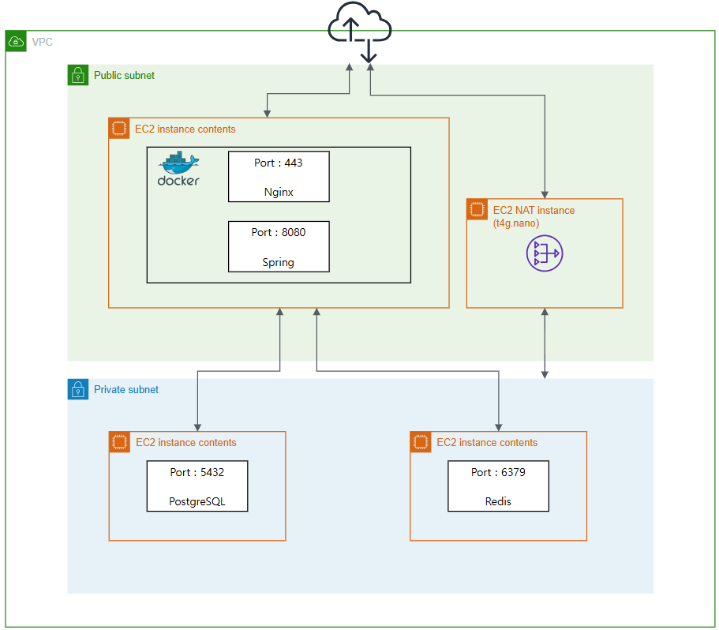

**HMG Softeer Bootcamp 7th - Team3**

&emsp; 

 

**초보 외식업 사장님을 위한 실시간 매장 운영 관리 서비스**

---

## 💡 프로젝트 소개

### 🚀 프로젝트 개요
급변하는 시장에서 많은 자영업자가 매장 운영의 명확한 기준 없이 폐업 위기에 직면하고 있습니다. 특히 초보 사장님들은 **경험 부족, 데이터 활용 능력 부재, 비효율적인 운영 시스템**으로 인해 매장에서 발생하는 유의미한 데이터를 놓치고 있습니다. 체크메이트는 이러한 데이터 장벽을 낮춰 사장님의 성공적인 의사결정을 지원합니다.

### ✨ 주요 기능

* **맞춤형 매장 관리 대시보드**
  * 매장의 매출 현황 및 주요 지표를 실시간으로 시각화하여 제공합니다.
  * 사장님이 한눈에 매장의 상태를 파악할 수 있는 직관적인 UI/UX를 지향합니다.
* **하루 리포트**
  * 매장 마감 후, 당일의 성과와 다음 날의 핵심 할 일을 정리하여 제공합니다.
  * 복잡한 데이터 분석 없이도 다음 날의 운영 방향을 설정할 수 있도록 돕습니다.
* **AI 기반 질의응답**
  * 매장 운영 중 발생하는 궁금증을 AI에게 즉시 질문하고 답변을 얻을 수 있습니다.
  * 매출, 객단가 등 지표의 의미를 해석하고, 이를 바탕으로 매출 증대를 위한 운영 전략을 제안합니다.

 

[용어 사전](./docs/checkmate_glossary.md)
&emsp; &emsp; &emsp; &emsp; &emsp;  [상세 페이지 소개](./docs/checkmate_pages.md)

 

## 🏗️ 시스템 구성도

### 🧩 시스템 아키텍처

[자세히 보기](./docs/img/system_architecture.png)

 

### 🗂️ ERD

[자세히 보기](https://www.erdcloud.com/d/pATb7DHcJvvAoN2za)

 

## 🛠️ 기술스택

|     구분     |                                                                                                                                                                                                                                                                                                                                                                                                                                                                                                                                                                                  Skills                                                                                                                                                                                                                                                                                                                                                                                                                                                                                                                                                                                  |
|:----------:|:------------------------------------------------------------------------------------------------------------------------------------------------------------------------------------------------------------------------------------------------------------------------------------------------------------------------------------------------------------------------------------------------------------------------------------------------------------------------------------------------------------------------------------------------------------------------------------------------------------------------------------------------------------------------------------------------------------------------------------------------------------------------------------------------------------------------------------------------------------------------------------------------------------------------------------------------------------------------------------------------------------------------------------------------------------------------------------------------------------------------------------------------------------------------:|
|   **FE** |               |
|   **BE** |                                                                                                                                                                                                                                                                                                                                                                                                                                                                                                                                                                                                                                                                                                                                                   |
| **Infra** |                                                                                                                                                                                                                                                                                                                                                                                                                                                                                                                                                                                                          |

 

## 🧑🏻‍💻 팀 구성

| **권민선** ([@mskwon02](https://github.com/mskwon02)) | **이영재** ([@lee0jae330](https://github.com/lee0jae330)) | **이예진** ([@lwjmcn](https://github.com/lwjmcn)) | **이용범** ([@22DT](https://github.com/22DT)) | **정한울** ([@jho7535](https://github.com/jho7535)) |
| :---: | :---: | :---: | :---: | :---: |
|  |  |  |  |  |
| FE | FE | FE | BE | BE |
