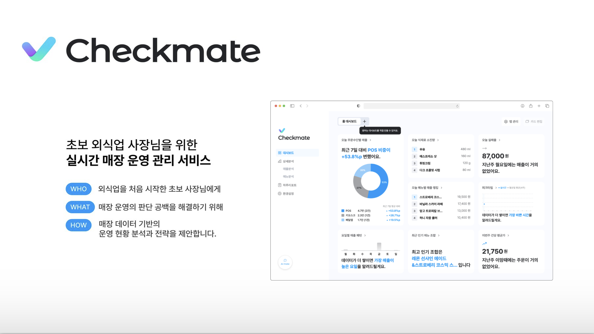

**HMG Softeer Bootcamp 7th - Team3**

  <strong> | </strong> &emsp;&emsp;
  <strong><a href="https://github.com/softeerbootcamp-7th/Team3-CheckMate/issues">ISSUE</a></strong>
  &emsp;&emsp; <strong> | </strong> &emsp;&emsp;
  <strong><a href="https://github.com/softeerbootcamp-7th/Team3-CheckMate/wiki">WIKI</a></strong>
  &emsp;&emsp; <strong> | </strong>

**초보 외식업 사장님을 위한 실시간 매장 운영 관리 서비스**

---

## 💡 프로젝트 소개

### 🚀 프로젝트 개요

급변하는 시장 환경 속에서 운영 기준 부재로 위기를 겪는 자영업자를 위해, **데이터 장벽을 낮추고 효율적인 의사결정을 지원하는 매장 관리 솔루션**입니다.

### ✨ 주요 기능

- **맞춤형 매장 관리 대시보드**
  - 매장의 매출 현황 및 주요 지표를 실시간으로 시각화하여 제공합니다.
  - 사장님이 한눈에 매장의 상태를 파악할 수 있는 직관적인 UI/UX를 지향합니다.
- **하루 리포트**
  - 매장 마감 후, 당일의 성과와 다음 날의 핵심 할 일을 정리하여 제공합니다.
  - 복잡한 데이터 분석 없이도 다음 날의 운영 방향을 설정할 수 있도록 돕습니다.
- **AI 기반 질의응답**
  - 매장 운영 중 발생하는 궁금증을 AI에게 즉시 질문하고 답변을 얻을 수 있습니다.
  - 매출, 객단가 등 지표의 의미를 해석하고, 이를 바탕으로 매출 증대를 위한 운영 전략을 제안합니다.

### 📚 [용어 사전](./docs/checkmate_glossary.md)

 

## 🏗️ 시스템 구성도

### 🧩 시스템 아키텍처

[자세히 보기](./docs/img/system_architecture.png)

 

### 🗂️ ERD

[자세히 보기](https://www.erdcloud.com/d/pATb7DHcJvvAoN2za)

 

## 🛠️ 기술스택

|   구분    |                                                                                                                                                                                                                                                                                                                                                                                                                                                                                                                               Skills                                                                                                                                                                                                                                                                                                                                                                                                                                                                                                                               |
| :-------: | :----------------------------------------------------------------------------------------------------------------------------------------------------------------------------------------------------------------------------------------------------------------------------------------------------------------------------------------------------------------------------------------------------------------------------------------------------------------------------------------------------------------------------------------------------------------------------------------------------------------------------------------------------------------------------------------------------------------------------------------------------------------------------------------------------------------------------------------------------------------------------------------------------------------------------------------------------------------------------------------------------------------------------------------------------------------: |
|  **FE**   |              |
|  **BE**   |                                                                                                                                                                                                                                                                                                                                                                                                                                                                                                                                                                                                                                             |
| **Infra** |                                                                                                                                                                                                                                                                                |

 

## 🧑🏻‍💻 팀 구성

|                                **권민선** ([@mskwon02](https://github.com/mskwon02))                                |                              **이영재** ([@lee0jae330](https://github.com/lee0jae330))                              |                                **이예진** ([@lwjmcn](https://github.com/lwjmcn))                                 |                                   **이용범** ([@22DT](https://github.com/22DT))                                    |                               **정한울** ([@jho7535](https://github.com/jho7535))                                |
| :--------------------------------------------------------------------------------------------------------------------: | :--------------------------------------------------------------------------------------------------------------------: | :-----------------------------------------------------------------------------------------------------------------: | :-------------------------------------------------------------------------------------------------------------------: | :-----------------------------------------------------------------------------------------------------------------: |
|  |  |  |  |  |
|                                                           FE                                                           |                                                           FE                                                           |                                                         FE                                                          |                                                          BE                                                           |                                                         BE                                                          |

 

## 📄 상세 페이지 소개

### 대시보드

> 매장의 매출 및 운영에 대한 실시간 지표를 한눈에 확인할 수 있는 페이지입니다.

- 기본으로 제공되는 홈 대시보드 외에도, 대시보드 추가/편집을 통해 사용자 목적에 맞는 분석 화면을 구성할 수 있습니다.

 

- 카드 편집 기능을 통해 대시보드를 구성하는 지표 카드를 드래그 앤 드롭 방식으로 자유롭게 배치할 수 있습니다.

### 상세분석

> 매장의 매출/메뉴 데이터를 다양한 기간 단위로 분석할 수 있는 페이지입니다.  
> 기간 선택 버튼을 통해 원하는 기간을 직접 설정하여, 특정 시점의 매출 데이터를 구체적으로 분석할 수 있습니다.

**1. 매출분석**

- 매출 현황, 매출 유입 구조, 매출 추이, 매출 패턴 데이터를 확인할 수 있습니다.

**2. 메뉴 분석**

- 인기 메뉴, 시간대별 메뉴 판매 패턴, 식재료 소진량, 인기 메뉴 조합 데이터를 확인할 수 있습니다.

### 하루 리포트

> 매장의 하루 및 월간 운영 데이터를 기반으로 자동 발행되는 리포트를 확인할 수 있는 페이지입니다.  
> 리포트에는 매출 요약과 인사이트가 제공되어 매장 운영 성과를 한눈에 파악할 수 있습니다.

- 캘린더를 통해 과거에 발행된 리포트를 열람할 수 있습니다.

 

- 새로운 리포트가 발행되면 알림을 통해 사용자에게 안내됩니다.

### 식재료 관리

> 메뉴별 식재료 정보를 조회하고 편집할 수 있는 페이지입니다.

- 식재료 AI 자동완성 기능을 통해 식재료 목록을 자동으로 추천받아 빠르게 등록할 수 있습니다.

### AI Mate

> 사이드바 좌측 하단의 ‘AI Mate’ 버튼을 통해 AI 챗봇 기능을 사용할 수 있습니다.

- AI에게 매장 운영과 관련된 질문을 물어볼 수 있습니다.

