# 📄 체크메이트 페이지 소개

## 대시보드

> 매장의 매출 및 운영에 대한 실시간 지표를 한눈에 확인할 수 있는 페이지입니다.

* 기본으로 제공되는 홈 대시보드 외에도, 대시보드 추가/편집을 통해 사용자 목적에 맞는 분석 화면을 구성할 수 있습니다.

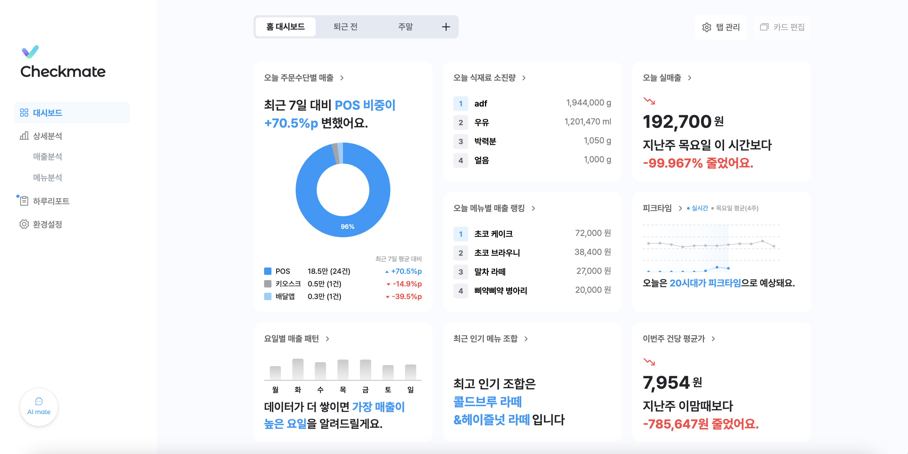

 

* 카드 편집 기능을 통해 대시보드를 구성하는 지표 카드를 드래그 앤 드롭 방식으로 자유롭게 배치할 수 있습니다.

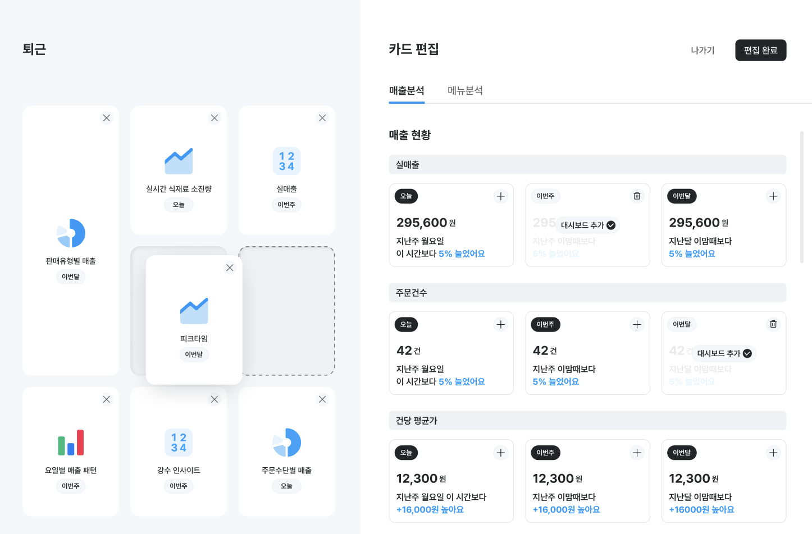

## 상세분석

> 매장의 매출/메뉴 데이터를 다양한 기간 단위로 분석할 수 있는 페이지입니다.  
> 기간 선택 버튼을 통해 원하는 기간을 직접 설정하여, 특정 시점의 매출 데이터를 구체적으로 분석할 수 있습니다.

### 매출분석

* 매출 현황, 매출 유입 구조, 매출 추이, 매출 패턴 데이터를 확인할 수 있습니다.

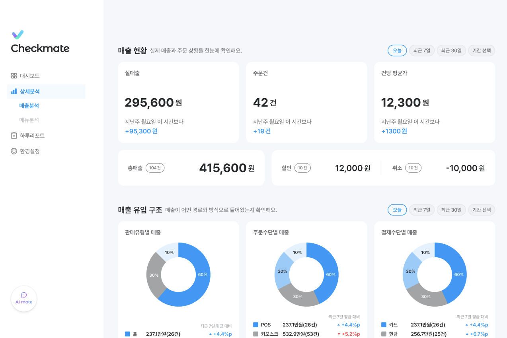
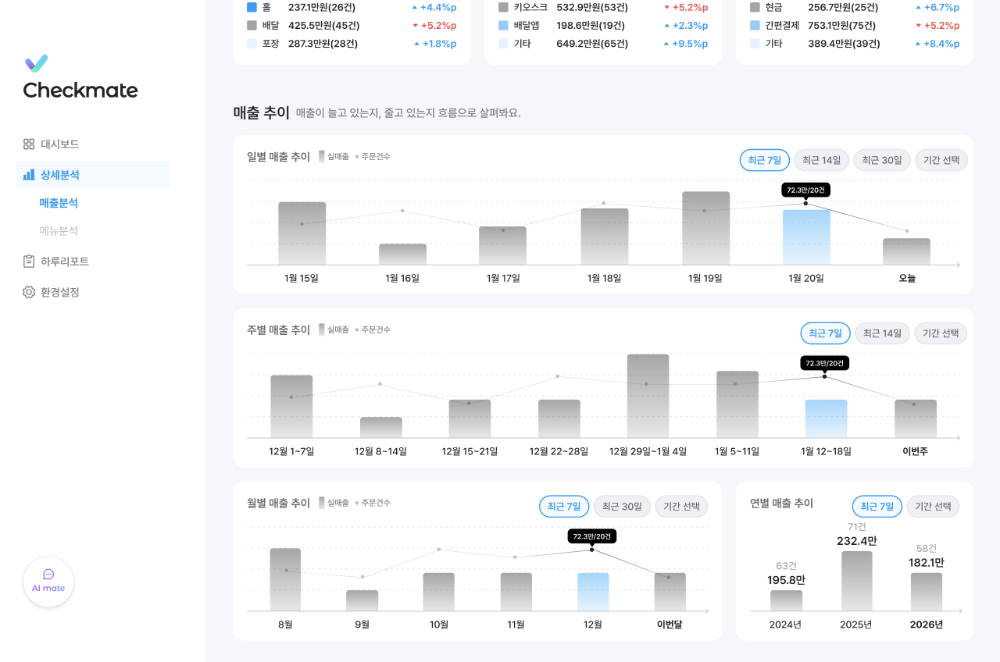

### 메뉴 분석

* 인기 메뉴, 시간대별 메뉴 판매 패턴, 식재료 소진량, 인기 메뉴 조합 데이터를 확인할 수 있습니다.

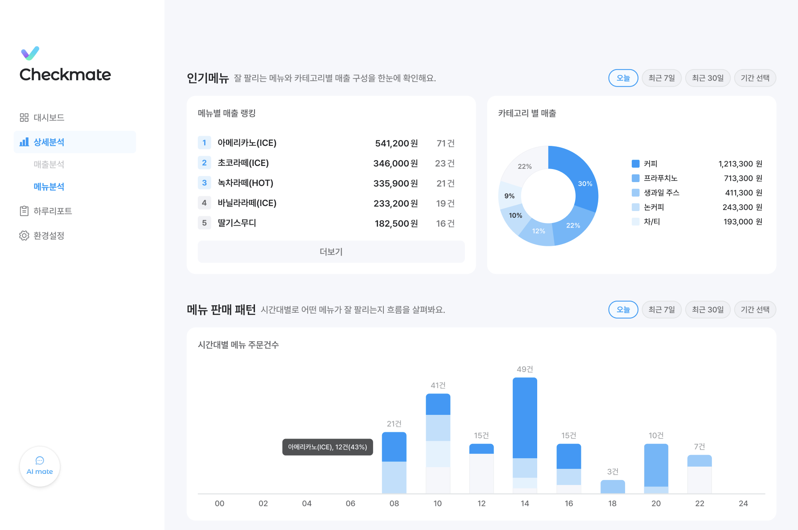
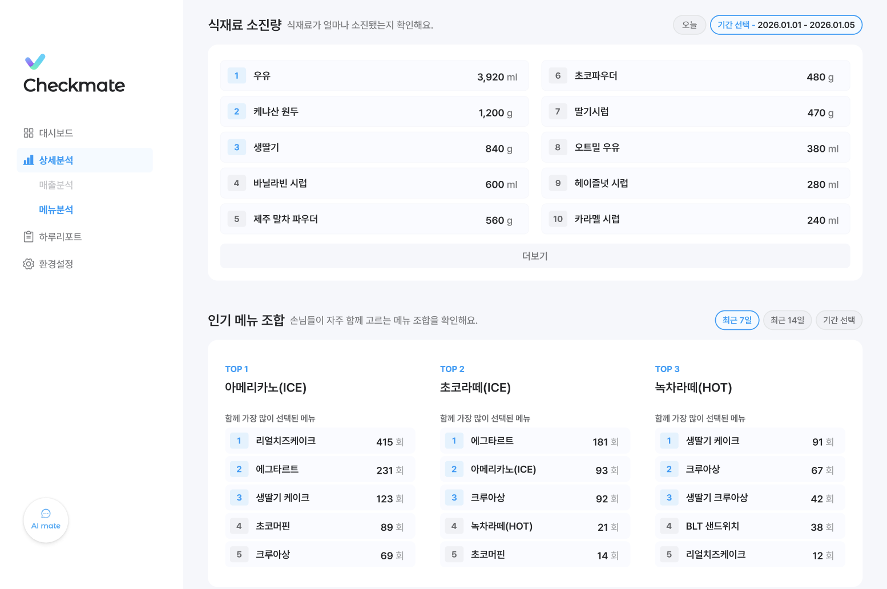

## 하루 리포트

> 매장의 하루 및 월간 운영 데이터를 기반으로 자동 발행되는 리포트를 확인할 수 있는 페이지입니다.  
> 리포트에는 매출 요약과 인사이트가 제공되어 매장 운영 성과를 한눈에 파악할 수 있습니다.

* 캘린더를 통해 과거에 발행된 리포트를 열람할 수 있습니다.

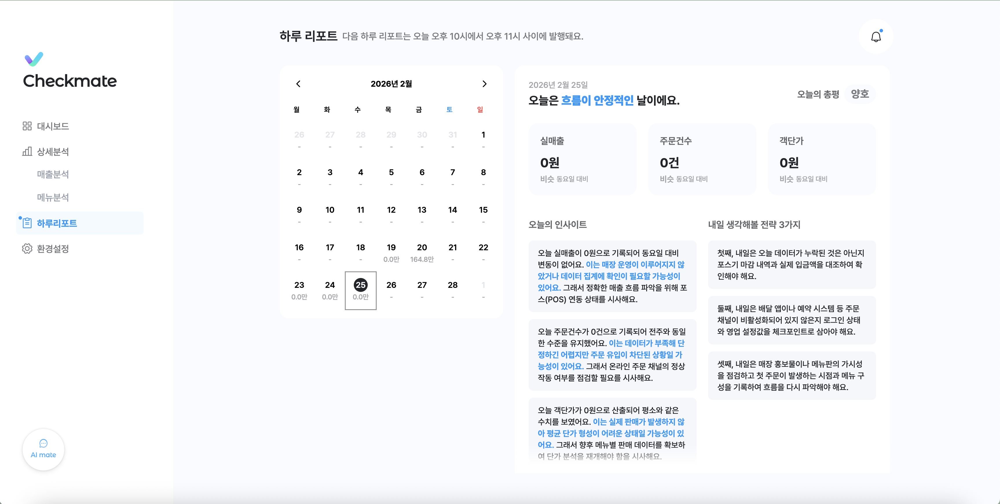

 

* 새로운 리포트가 발행되면 알림을 통해 사용자에게 안내됩니다.

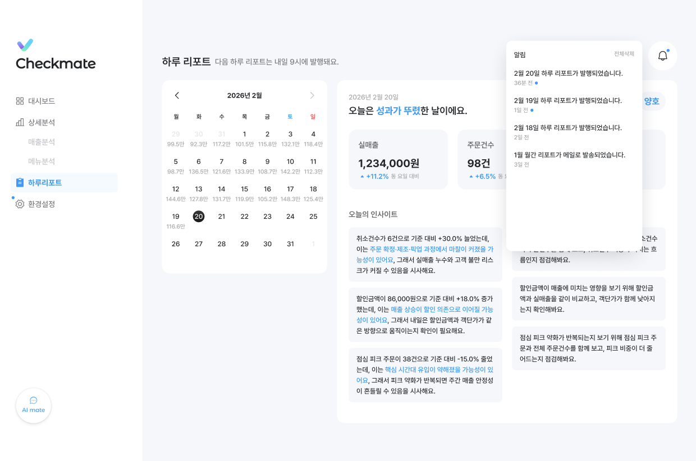

## 식재료 관리

> 메뉴별 식재료 정보를 조회하고 편집할 수 있는 페이지입니다.

* 식재료 AI 자동완성 기능을 통해 식재료 목록을 자동으로 추천받아 빠르게 등록할 수 있습니다.

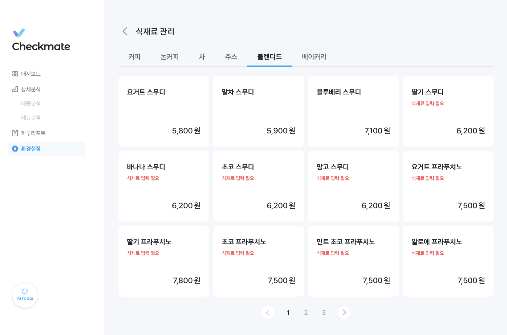
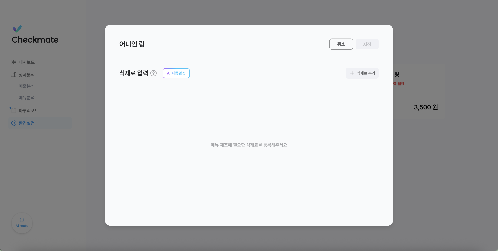

## AI Mate

> 사이드바 좌측 하단의 ‘AI Mate’ 버튼을 통해 AI 챗봇 기능을 사용할 수 있습니다.

* AI에게 매장 운영과 관련된 질문을 물어볼 수 있습니다.

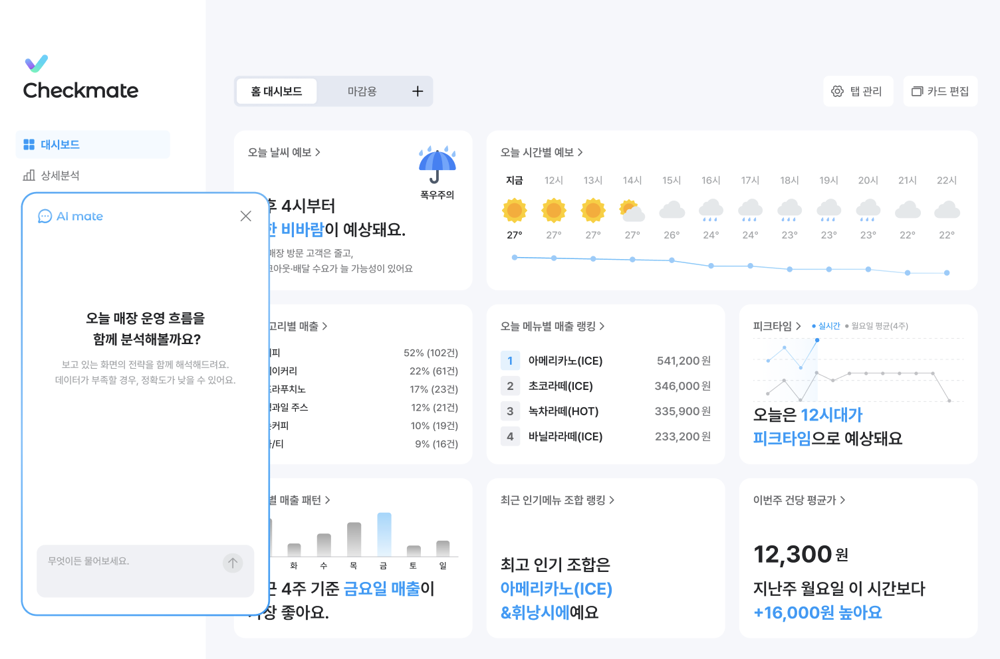