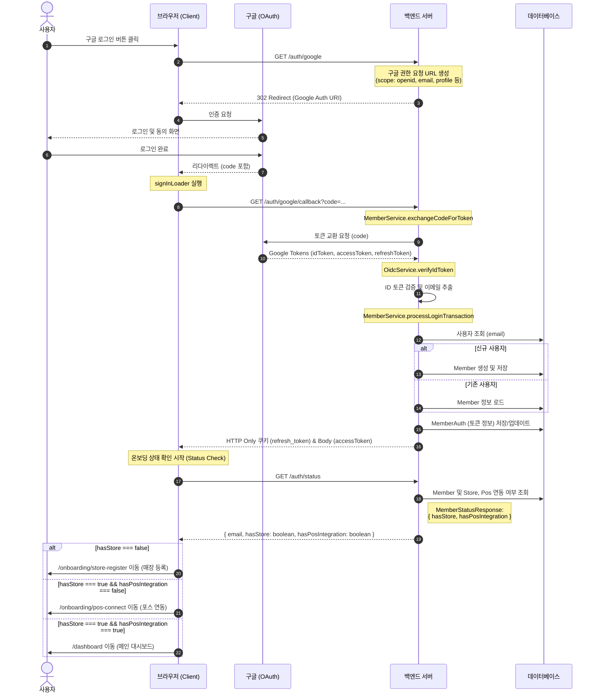

## 0. 개요

단순히 '구글 로그인을 통한 간편 인증' 구현을 넘어, 인증(Authentication)과 권한 위임(Authorization)을 분리하고, 구글 서비스(Gmail API)와의 연동 확장성을 고려한 구조를 정리합니다.

 

<h2>1. 핵심 개념: OAuth 2.0 vs OIDC</h2>

구현에 앞서 두 프로토콜의 역할을 다음과 같이 정의하여 사용했습니다.

구분 | OAuth 2.0 | OIDC (OpenID Connect)
-- | -- | --
목적 | 권한 위임 (Authorization) | 신원 확인 (Authentication)
주요 토큰 | Access Token (리소스 접근용) | ID Token (사용자 정보 포함 JWT)
핵심 역할 | 우리 서버가 사용자를 대신해 구글 API 호출 | 우리 앱에 로그인한 사용자가 누구인지 확인

<strong>프로젝트 적용 포인트:</strong>

<ul>
<li><strong>OIDC 활용:</strong> 구글이 발행한 <strong>ID Token</strong>을 <code>OidcService</code>에서 직접 검증하고 이메일을 추출했습니다. 별도의 UserInfo API 호출을 생략하여 네트워크 비용을 절감했습니다.</li>
<li><strong>OAuth 2.0 활용:</strong> <code>access_type=offline</code> 설정을 통해 <strong>Google Refresh Token</strong>을 확보했습니다. 이는 초기 기획 단계에서 '분석된 리포트를 사용자의 구글 메일로 자동 발송'하는 기능을 염두에 둔 설계입니다.</li>
</ul>

 

<h2>2. 로그인 파이프라인</h2>
<h3>단계 1: 권한 요청 (GET <code>/auth/google</code>)</h3>

사용자를 구글 인증 서버로 리다이렉트합니다.

<ul>
<li><strong>설정:</strong> <code>clientId</code>, <code>redirectUri</code>, <code>scope(openid, email, profile)</code> 등을 포함합니다.</li>
</ul>
<h3>단계 2: 콜백 및 검증 (GET <code>/auth/google/callback</code>)</h3>

구글로부터 받은 인증 코드(<code>code</code>)를 처리합니다.

<ol>
<li><strong>토큰 교환:</strong> <code>exchangeCodeForToken</code> 로직을 통해 구글로부터 Access/Refresh/ID Token을 수신합니다. 네트워크 불안정성을 고려해 최대 3회 재시도 로직을 포함했습니다.</li>
<li><strong>ID 토큰 검증:</strong> <code>OidcService</code>에서 ID Token의 서명을 확인하여 위변조 여부를 검증하고, 페이로드에서 사용자 식별 정보(email)를 추출합니다.</li>
</ol>
<h3>단계 3: 회원 처리 및 토큰 저장</h3>

인증된 정보를 바탕으로 서비스 자체 세션을 생성하고 외부 토큰을 관리합니다.

<ol>
<li><strong>회원 가입/조회:</strong> 이메일 기반으로 신규 회원은 가입을, 기존 회원은 로그인을 진행합니다.</li>
<li><strong>서비스 JWT 생성:</strong> 우리 서비스 전용 Access Token(Body)과 Refresh Token(Cookie)을 생성하여 클라이언트 세션을 관리합니다.</li>
<li><strong>데이터 저장:</strong> <code>MemberAuth</code> 테이블에 <strong>구글용 Access/Refresh Token</strong>을 함께 저장합니다. 당장 리포트 메일 발송 기능을 연동하지 않더라도, 추후 사용자의 추가 동의 없이 구글 API를 호출할 수 있는 기틀을 마련했습니다.</li>
</ol>

 

<h2>3. 보안 및 아키텍처 특징</h2>
<ul>
<li><strong>토큰 저장소 분리:</strong> 서비스 세션을 위한 JWT와 구글 API 호출을 위한 Google Token을 함께 관리하여, 로그인 유지와 기능 확장(Gmail API를 통한 리포트 전송)에 유연하게 대응합니다.</li>
<li><strong>쿠키 기반 세션 관리:</strong> 서비스 Refresh Token은 <code>HttpOnly</code>, <code>Secure</code> 쿠키로 설정하여 보안을 강화했습니다.</li>
<li><strong>확장 가능한 구조:</strong> Google Refresh Token을 DB에 암호화하여 보관함으로써, 백엔드 워커(Worker) 프로세스가 사용자 개입 없이 비동기적으로 구글 서비스를 이용할 수 있는 구조를 갖췄습니다.</li>
</ul>

 

<h2>4. 결론</h2>

이번 구현을 통해 OIDC를 통한 효율적인 신원 확인과 OAuth 2.0을 통한 외부 권한 확보를 동시에 달성했습니다. 단순히 로그인 수단을 제공하는 것에 그치지 않고, 수집된 토큰을 활용해 향후 리포트 메일 발송과 같은 구글 생태계 연동 기능을 즉시 도입할 수 있는 확장성 있는 기반을 구축하는 데 집중했습니다.

