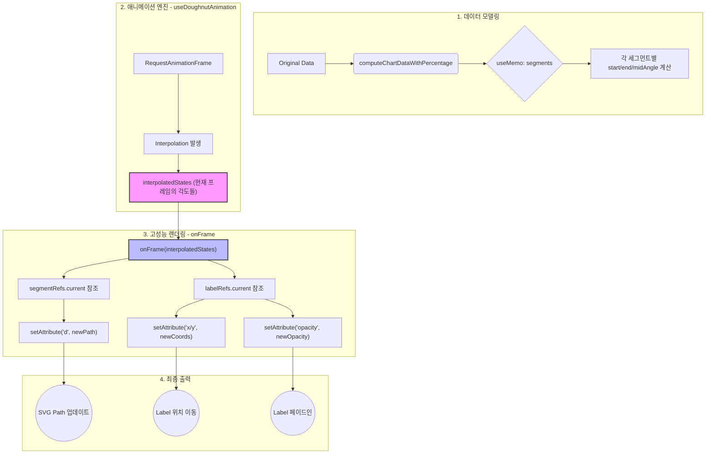

- [0. SVG 시작하기](#0-svg-시작하기)
  * [왜 라이브러리 없이 직접 구현했는가?](#왜-라이브러리-없이-직접-구현했는가)
  * [**Canvas vs SVG: 왜 SVG인가?**](#canvas-vs-svg-왜-svg인가)
  * [SVG 튜토리얼](#svg-튜토리얼)
- [1. SVG Path `A` 명령어로 호(Arc) 그리기](#1-svg-path-a-명령어로-호arc-그리기)
- [2. 로딩 애니메이션 구현하기](#2-로딩-애니메이션-구현하기)
  * [단순 좌표 애니메이션](#단순-좌표-애니메이션)
  * [Dasharray와 Dashoffset을 이용한 애니메이션](#dasharray와-dashoffset을-이용한-애니메이션)
  * [requestAnimationFrame을 사용한 React 컴포넌트](#requestanimationframe을-사용한-react-컴포넌트)
- [3. 여러 데이터의 순차적 로딩 (Cumulative Animation)](#3-여러-데이터의-순차적-로딩-cumulative-animation)
- [4. 데이터 라벨 및 페이드 인](#4-데이터-라벨-및-페이드-인)
- [5. 실시간 데이터 변경](#5-실시간-데이터-변경)
  * [Dashoffset 방식의 한계](#dashoffset-방식의-한계)
- [6. Interpolation 기반 애니메이션](#6-interpolation-기반-애니메이션)
  * [데이터 모델링](#데이터-모델링)
  * [**onFrame 렌더링 엔진**](#onframe-렌더링-엔진)
  * [유틸리티 로직](#유틸리티-로직)
  * [플로우 차트](#플로우-차트)
- [7. 추가 보정 로직](#7-추가-보정-로직)
  * [퍼센테이지 합계 100% 보장](#퍼센테이지-합계-100-보장)
  * [360도(100%) 처리](#360도100-처리)
  * [레이블 색상 및 가독성 시스템](#레이블-색상-및-가독성-시스템)
  * [가이드라인 호 추가](#가이드라인-호-추가)
- [8. 결과](#8-결과)
  * [스토리북](#스토리북)
  * [영상](#영상)
  * [회고](#회고)
- [참고자료](#참고자료)


## 0. SVG 시작하기

### 왜 라이브러리 없이 직접 구현했는가?

사실 Chart.js나 Recharts를 쓰면 훨씬 세련된 차트를 순식간에 뽑아낼 수 있습니다. 그럼에도 불구하고 밑바닥부터 직접 구현한 이유는 크게 세 가지입니다.

- **Joy of Learning**: 추상화된 라이브러리 뒤에 숨겨진 SVG의 수학적 원리(삼각함수, 호의 계산 등)를 직접 체득하는 즐거움이 컸습니다.
- **커스터마이징**: 라이브러리의 설정값만으로는 해결되지 않는 미세한 애니메이션 디테일을 입맛대로 다루고 싶었습니다.
- **가벼운 결과물**: 단 하나의 차트를 위해 수십 KB의 라이브러리를 불러오는 대신, 핵심 로직만 담긴 담백한 컴포넌트를 지향했습니다.

### **Canvas vs SVG: 왜 SVG인가?**

웹에서 그래픽을 그리는 두 가지 주요 방식 중, 도넛 차트 구현에 SVG를 선택한 근거는 다음과 같습니다.

| **비교 항목** | **Canvas** | **SVG (선택)** |
| --- | --- | --- |
| 렌더링 방식 | 비트맵 (Pixel 기반) | 벡터 (수식 기반) |
| 확대/축소 | 해상도 저하 발생 가능 | 어떤 해상도에서도 선명함 |
| DOM 접근성 | 불가능 (단일 요소) | 가능 (각 Path가 DOM 요소) |
| 애니메이션 | 매 프레임 전체 재그리기 필요 | CSS/SMIL/Direct DOM 제어 가능 |
| 인터랙션 | 좌표 계산을 통한 충돌 감지 필요 | 이벤트 리스너(onClick, onHover) 직접 등록 |

데이터 포인트가 수천 개, 수만 개가 되면 SVG는 조각마다 DOM 요소를 생성해야 하지만, Canvas는 픽셀을 한 번 찍고 잊어버리면 그만이라 메모리 점유율과 렌더링 속도에서 압도적입니다. 그러나 이번 프로젝트에서는 데이터 개수가 한정되어 있기 때문에 위 Canvas의 장점이 무의미 하다고 생각했습니다. 

따라서 DOM을 통해 다른 컴포넌트와 같이 레이아웃을 잡고, 이벤트 핸들링을 쉽게 할 수 있는 SVG를 선택했습니다.

### SVG 튜토리얼

https://github.com/softeerbootcamp-7th/WEB-Team3-CheckMate/wiki/SVG-%ED%8A%9C%ED%86%A0%EB%A6%AC%EC%96%BC-%EC%A0%95%EB%A6%AC

## 1. SVG Path `A` 명령어로 호(Arc) 그리기

도넛 차트의 각 조각은 SVG의 `path` 요소를 사용합니다. `A` 명령어를 사용하여 원호(Arc)를 정의합니다.

**핵심 파라미터**

- `A rx ry x-axis-rotation large-arc-flag sweep-flag x y`
- `large-arc-flag`: 각도가 180도보다 크면 `1`, 작으면 `0`으로 설정합니다.
- `sweep-flag`: `1`로 설정 시 시계 방향으로 호를 그립니다.

도넛 모양은 두꺼운 `stroke-width`를 가진 호를 그리거나, 바깥쪽 호와 안쪽 호를 연결한 면(Fill)을 채우는 방식으로 구현할 수 있습니다.

## 2. 로딩 애니메이션 구현하기

### 단순 좌표 애니메이션

https://github.com/user-attachments/assets/87313d46-a119-46bd-acea-a30034a5b8e8

위에서 그린 호에서 `path`의 `d` 속성에 들어가는 종료 좌표(`END_X`, `END_Y`)를 시간에 따라 직접 변경하면 시각적으로 매우 어색한 결과를 초래합니다. (위 동영상 참고)

단순 좌표 애니메이션을 하면, **호의 궤적을 무**시합니다. SVG에서 `A` 명령어의 끝점 좌표만 변경하면, 호가 원의 둘레를 따라 부드럽게 늘어나는 것이 아니라 시작점에서 목표점까지 직선에 가까운 기괴한 경로로 휘어지며 모양이 변합니다.

<details>

<summary>코드</summary>
    
    ```jsx
    		<svg
          xmlns="http://www.w3.org/2000/svg"
          viewBox="0 0 400 400"
          style={{ backgroundColor: '#fff' }}
        >
          <path
            d={`  M 200 0 
                A 200 200 0 0 1 400 200
                L 300 200
                A 100 100 0 0 0 200 100
                Z
                `}
            stroke="red"
          >
            <animate
              attributeName="d"
              from={`
                M 200 0 
                A 200 200 0 0 1 400 200
                L 300 200
                A 100 100 0 0 0 200 100
                Z
              `}
              to={`
                M 200 0 
                A 200 200 0 0 1 200 400
                L 200 300
                A 100 100 0 0 0 200 100
                Z
              `}
              dur="2s"
            />
          </path>
        </svg>
    ```
</details>

### Dasharray와 Dashoffset을 이용한 애니메이션

따라서 이미 그려진 원형 경로를 활용하기 위해 호의 `stroke` 속성을 활용합니다. 실선인 `stroke`를 점선으로 바꾸고, 그 점선의 시작 위치(`offset`)를 이동시켜 선이 그려지는 듯한 효과를 줍니다.

**stroke 속성**

1. `stroke-dasharray`: `[실선 길이] [공백 길이]`의 반복 패턴을 정의합니다.
2. `stroke-dashoffset`: 점선 패턴의 시작점을 밀어냅니다.
3. 애니메이션 원리
    - `dasharray`를 `[호의 총 길이] [나머지 전체 원주]`만큼 설정합니다.
    - `dashoffset`을 `호의 길이`에서 `0`으로 변화시키면, 숨겨져 있던 선이 앞으로 밀려 나오며 나타납니다.

https://github.com/user-attachments/assets/9745a698-15eb-42c8-8bff-524ac55787b5


<details>

<summary>코드</summary>
    
    ```jsx
    			<svg
    		      xmlns="http://www.w3.org/2000/svg"
    		      viewBox="0 0 400 400"
    		      style={{ backgroundColor: '#fff' }}
    		    >
    						<path
                  key={data.label}
                  d={`M ${INIT_X} ${INIT_Y} ${path}`}
                  stroke={data.color}
                  stroke-width={STROKE_WIDTH}
                  stroke-dasharray="70 10"
                  fill="none"
                >
                  <animate
                    attributeName="stroke-dashoffset"
                    from="50"
                    to="0"
                    dur="1s"
                    begin="0s"
                    fill="freeze"
                  />
                </path>
            </svg>
    ```
</details>

### requestAnimationFrame을 사용한 React 컴포넌트

`requestAnimationFrame` 또는 SMIL(`<animate />`)을 사용하여 호가 동적으로 늘어나는 연출을 구현합니다.

1. 차트가 그려지는 진행률(0% - 100%)을 부드럽게 계산하기 위해 브라우저의 프레임 재생 빈도에 맞춘 `step` 함수를 실행합니다.
    - **델타 타임(Delta Time) 활용**: 프레임 간의 시간 차이(`delta`)를 계산하여 기기의 성능에 상관없이 일정한 속도로 퍼센티지가 증가하도록 구현합니다.
    - **상태 동기화**: `useRef`를 사용하여 최신 퍼센티지 값을 참조(`percentRef`)함으로써, 비동기적인 `setPercentage` 호출 사이에서도 정확한 다음 값을 계산합니다.
    
    ```jsx
    const increment = delta * 0.01; // ms 당 증가량으로 속도 조절
    const next = Math.min(100, Math.round((prev + increment) * 100) / 100);
    setPercentage(next);
    ```
    
2. 계산된 퍼센티지를 각도(Degree)로 변환하고, 이를 다시 SVG `path`에서 사용할 2차원 좌표($x, y$)로 변환해야 합니다.
    - **각도 보정**: SVG의 기본 0도 방향을 차트의 시작점인 상단(12시)으로 옮기기 위해 $\pi/2$ (90도)를 빼주는 보정 과정을 거칩니다.
    - **삼각함수를 이용한 동적 좌표 계산**
        - $x = \text{Radius} \cdot \cos(\text{AdjustedRadian}) + \text{CenterX}$
        - $y = -\text{Radius} \cdot \sin(\text{AdjustedRadian}) + \text{CenterY}$ (SVG의 $y$축은 아래로 갈수록 커지므로 $\sin$ 값에 마이너스를 취함)
3. 전체 차트의 형태를 결정하는 path `d` 속성은 퍼센티지가 변함에 따라 실시간으로 재구성됩니다.
    - `LARGE_ARC_FLAG`: `percentage`가 50%를 넘어서는 순간(각도 > 180도) 이 플래그가 `0`에서 `1`로 바뀌어야 원의 짧은 경로가 아닌 긴 경로를 따라 호가 그려집니다.

<details>

<summary>코드</summary>
    
    ```jsx
    import { useEffect, useRef, useState } from 'react';
    
    export const PieChart = () => {
      const [percentage, setPercentage] = useState(0);
      const rafRef = useRef<number | null>(null);
      const lastTimestampRef = useRef<number | null>(null);
      const percentRef = useRef<number>(percentage);
    
      useEffect(() => {
        percentRef.current = percentage;
      }, [percentage]);
    
      useEffect(() => {
        const step = (timestamp: number) => {
          console.log('step', timestamp);
          if (lastTimestampRef.current === null) {
            lastTimestampRef.current = timestamp;
          }
          const delta = timestamp - lastTimestampRef.current;
          lastTimestampRef.current = timestamp;
    
          const prev = percentRef.current;
          if (prev >= 100) {
            if (rafRef.current !== null) {
              cancelAnimationFrame(rafRef.current);
              rafRef.current = null;
            }
            return;
          }
    
          const increment = delta * 0.01; // 조절 가능한 속도 (ms 당 증가량)
          const next = Math.min(100, Math.round((prev + increment) * 100) / 100);
          percentRef.current = next;
          setPercentage(next);
    
          if (next >= 100) {
            if (rafRef.current !== null) {
              cancelAnimationFrame(rafRef.current);
              rafRef.current = null;
            }
            return;
          }
    
          rafRef.current = requestAnimationFrame(step);
        };
    
        rafRef.current = requestAnimationFrame(step);
        return () => {
          if (rafRef.current !== null) {
            cancelAnimationFrame(rafRef.current);
          }
          rafRef.current = null;
          lastTimestampRef.current = null;
        };
      }, []);
    
      const VIEW_RADIUS = 180;
      const VIEW_SIZE = VIEW_RADIUS * 2;
      const CLIP_RADIUS = 100;
      const STROKE_WIDTH = VIEW_RADIUS - CLIP_RADIUS;
      const DONUT_RADIUS = CLIP_RADIUS + STROKE_WIDTH / 2;
    
      // 시작점은 원의 상단 중앙
      const START_X = VIEW_RADIUS;
      const START_Y = VIEW_RADIUS - DONUT_RADIUS;
    
      const degree = 360 * (percentage / 100); // 0~360도
      const LARGE_ARC_FLAG = degree > 180 ? 1 : 0;
      const radian = (degree / 180) * Math.PI;
      const radianAdjusted = Math.PI / 2 - radian; // 0도 기준을 위쪽으로 조정
      const END_X = DONUT_RADIUS * Math.cos(radianAdjusted) + VIEW_RADIUS;
      const END_Y = -DONUT_RADIUS * Math.sin(radianAdjusted) + VIEW_RADIUS; // svg 뷰포트에서 y축 양방향은 아래쪽임
    
      return (
        <svg
          xmlns="http://www.w3.org/2000/svg"
          viewBox={`0 0 ${VIEW_SIZE} ${VIEW_SIZE}`}
          style={{ backgroundColor: '#fff' }}
        >
          <path
            d={`M ${START_X} ${START_Y}
                A ${DONUT_RADIUS} ${DONUT_RADIUS} 0 ${LARGE_ARC_FLAG} 1 ${END_X} ${END_Y}`}
            stroke="red"
            strokeWidth={STROKE_WIDTH}
            // stroke-dasharray="210 400"
            // stroke-dashoffset="0"
            fill="none"
          >
            <animate
              attributeName="stroke-dashoffset"
              from="210"
              to="0"
              dur="1s"
              begin="0s"
              fill="freeze"
            />
          </path>
          <text x={30} y={20} textAnchor="middle" dominantBaseline="middle">
            {percentage}%
          </text>
          <circle cx={VIEW_RADIUS} cy={VIEW_RADIUS} r={5} fill="black" />
          <circle cx={START_X} cy={START_Y} r={5} fill="black" />
          <circle cx={END_X} cy={END_Y} r={5} fill="black" />
        </svg>
      );
    };
    
    ```

</details>

## 3. 여러 데이터의 순차적 로딩 (Cumulative Animation)

여러 데이터를 한꺼번에 렌더링할 때, 이전 조각이 그려진 후 다음 조각이 나타나도록 `begin` 타임을 누적하여 계산합니다.

**구현 로직**

- 누적 각도(Cumulative Degree): 이전 데이터들의 퍼센테이지 합을 각도로 환산하여 현재 조각의 시작 좌표를 결정합니다.
- 누적 시간(Cumulative Duration): `cumulativeDegree`에 비례하여 애니메이션 시작 시점(`begin`)을 딜레이시킵니다.
- 공백 처리: 원주만큼 `dasharray`의 빈칸을 충분히 주어야 조각 사이의 잔상이 남지 않습니다.


https://github.com/user-attachments/assets/092f43b9-0e93-4a4e-9d68-f0847b1d77e7


<details>

<summary>코드</summary>

    
    ```jsx
    export const PieChart = () => {
      const ANIMATION_DURATION_MS = 500;
      const VIEW_RADIUS = 180;
      const VIEW_SIZE = VIEW_RADIUS * 2;
      const CLIP_RADIUS = 100;
      const STROKE_WIDTH = VIEW_RADIUS - CLIP_RADIUS;
      const DONUT_RADIUS = CLIP_RADIUS + STROKE_WIDTH / 2;
    
      // 100% percentage -> 180도 degree
      const getDegreeFromPercentage = (percentage: number) => {
        const degree = 360 * (percentage / 100); // 0~360도
        return degree;
      };
    
      const getArcLength = (degree: number) => {
        return 2 * Math.PI * DONUT_RADIUS * (degree / 360);
      };
    
      // 180도 degree -> (x, y) coordinate
      const getCoordinates = (degree: number) => {
        const radian = (degree / 180) * Math.PI;
    
        // 0도 시작점은 원의 상단 중앙, 시계방향으로 증가
        const adjustedRadian = Math.PI / 2 - radian;
    
        const x = DONUT_RADIUS * Math.cos(adjustedRadian) + VIEW_RADIUS;
        const y = -DONUT_RADIUS * Math.sin(adjustedRadian) + VIEW_RADIUS; // svg 뷰포트에서 y축 양방향은 아래쪽임
        return { x, y };
      };
    
      const getPath = (degree: number, cumulativeDegree: number) => {
        const LARGE_ARC_FLAG = degree > 180 ? 1 : 0;
    
        const { x: START_X, y: START_Y } = getCoordinates(cumulativeDegree);
        const { x: DELTA_X, y: DELTA_Y } = getCoordinates(
          cumulativeDegree + degree,
        );
        return `M ${START_X} ${START_Y} A ${DONUT_RADIUS} ${DONUT_RADIUS} 0 ${LARGE_ARC_FLAG} 1 ${DELTA_X} ${DELTA_Y}`;
      };
    
      const getAnimationDuration = (degree: number) => {
        return (ANIMATION_DURATION_MS * degree) / 360;
      };
    
      return (
        <svg
          xmlns="http://www.w3.org/2000/svg"
          viewBox={`0 0 ${VIEW_SIZE} ${VIEW_SIZE}`}
          style={{ backgroundColor: '#fff' }}
        >
          {SALES_DATA.sort((a, b) => b.percentage - a.percentage).map(
            (data, index) => {
              const cumulativePercentage = SALES_DATA.slice(0, index).reduce(
                (sum, item) => sum + item.percentage,
                0,
              );
              const cumulativeDegree =
                getDegreeFromPercentage(cumulativePercentage);
    
              const degree = getDegreeFromPercentage(data.percentage);
    
              const path = getPath(degree, cumulativeDegree);
    
              const arcLength = getArcLength(degree);
              const circumference = getArcLength(360);
    
              const animationDuration = getAnimationDuration(degree);
              const cumulativeAnimationDuration =
                getAnimationDuration(cumulativeDegree);
              return (
                <path
                  key={data.label}
                  d={path}
                  stroke={data.color || CHART_RANKING_COLORS[index]}
                  strokeWidth={STROKE_WIDTH}
                  strokeDasharray={` ${arcLength} ${circumference - arcLength}`}
                  strokeDashoffset={arcLength}
                  fill="none"
                >
                  <animate
                    attributeName="stroke-dashoffset"
                    from={arcLength}
                    to={0}
                    dur={`${animationDuration}ms`}
                    begin={`${cumulativeAnimationDuration}ms`}
                    fill="freeze"
                  />
                </path>
              );
            },
          )}
          <circle cx={VIEW_RADIUS} cy={VIEW_RADIUS} r={5} fill="black" />
          {/* <circle cx={START_X} cy={START_Y} r={5} fill="black" /> */}
          {/* <circle cx={END_X} cy={END_Y} r={5} fill="black" /> */}
        </svg>
      );
    };
    
    ```

</details>

## 4. 데이터 라벨 및 페이드 인

차트 각 조각의 중간 지점(`startDegree` + `degree`/2) 좌표를 계산하여 데이터 라벨을 배치합니다.

호가 다 그려지는 시점에 맞춰 fade in 애니메이션을 적용하여 라벨이 자연스럽게 나타나도록 처리합니다.


## 5. 실시간 데이터 변경

**늘어나는 경우 →** 데이터가 증가할 때는 단순히 `stroke-dasharray`의 실선 부분 값을 키우고 `offset`을 조절하면 자연스럽게 선이 더 길어집니다.

**줄어드는 경우 →** 이미 그려진 호의 전체 길이(`arcLength`) 자체가 줄어들어야 하므로, 이때는 `stroke-dashoffset`만 움직이는 게 아니라 `path`의 `d` 속성(좌표)과 `dasharray`를 동시에 정밀하게 계산하여 줄여야 합니다.

### Dashoffset 방식의 한계

이 방식은 초기 로딩에는 매우 효과적이지만, 데이터가 실시간으로 변경될 때 다음과 같은 제약이 있었습니다.

1. **(hard) 데이터 축소의 어려움**: `dashoffset`을 밀어내어 선을 늘리는 것은 직관적이지만, 특정 조각의 각도가 줄어들 때 `path` 자체의 `d` 속성과 `offset`을 동시에 줄이는 로직이 매우 복잡해집니다.
2. **(critical) 라벨의 직선 이동**: 데이터가 변해 호의 중간 지점이 바뀔 때, 라벨은 곡선을 따라 이동하지 않고 현재 위치에서 목표 위치까지 직선으로 이동하여 시각적으로 어색합니다.

## 6. Interpolation 기반 애니메이션

단순히 선을 긋는 애니메이션을 넘어, 데이터가 변경될 때 차트의 모든 요소(호의 길이, 시작 지점, 라벨의 위치)가 유기적으로 움직이게 하려면 상태 보간(State Interpolation) 방식이 필수적입니다.
****

기존의 `stroke-dashoffset` 방식이나 단순 CSS Transition 대신 Interpolation 직접 구현을 선택한 이유는 다음과 같습니다.

1. **데이터 변경 대응**: 단순히 0에서 100으로 늘어나는 것뿐만 아니라, 데이터가 30%에서 15%로 줄어들거나 위치가 바뀔 때 각 세그먼트가 부드럽게 자신의 자리를 찾아가야 합니다.
2. **다중 속성 동기화**: 호(`path`)가 움직일 때 그 호의 정중앙에 위치한 라벨(`text`)도 직선이 아닌 **곡선 궤적**을 그리며 함께 이동해야 합니다.

### 데이터 모델링

interpolation을 시작하기 전, 각 세그먼트의 '목표 상태'를 정의합니다. `reduce`를 사용하여 누적 각도를 계산하고 각 조각의 기하학적 데이터(`startAngle`, `endAngle`, `midAngle`)을 산출합니다.

```jsx
// 누적 각도를 활용한 세그먼트 모델링
const segments = chartDataWithPercentage.reduce((acc, data) => {
  const angle = getAngleFromPercentage(data.percentage);
  const startAngle = acc.cumulativeAngle;
  const endAngle = acc.cumulativeAngle + angle;
  const midAngle = (startAngle + endAngle) / 2; // 라벨의 타겟 위치

  acc.segments.push({ startAngle, endAngle, midAngle, ...data });
  acc.cumulativeAngle += angle;
  return acc;
  
  // cumulativeAngle은 다음 startAngle 계산을 위함
}, { segments: [], cumulativeAngle: 0 }); 
```

### **onFrame 렌더링 엔진**

애니메이션 프레임마다 호출되는 `onFrame` 함수는 보간된 상태(`interpolatedStates`)를 받아 실시간으로 DOM을 갱신합니다.

- **Path Interpolation**
    
    매 프레임마다 보간된 `startAngle`과 `endAngle`을 바탕으로 새로운 SVG Path 문자열을 생성합니다.
    
    - `getSVGPathFromAngle`: 보간된 두 각도 사이의 호를 그리는 `d` 속성 값을 반환합니다.
    - `segmentRef.setAttribute('d', path)`: React 상태를 거치지 않고 직접 경로를 주입하여 60fps의 부드러움을 확보합니다.
- **Label 위치 동기화**
    
    라벨은 호의 중간 지점인 `midAngle`을 추적합니다.
    
    - 곡선 이동: `midAngle`이 보간됨에 따라 라벨의 `x, y` 좌표가 삼각함수를 통해 계산되므로, 라벨은 차트의 원주를 따라 부드러운 곡선을 그리며 이동합니다.
    - 투명도 제어: `labelOpacity` 보간을 통해 차트 로딩 시 라벨이 자연스럽게 Fade-in 되도록 제어합니다.

### 유틸리티 로직

보간된 각도 데이터를 시각적 좌표로 변환하기 위해 다음과 같은 수학적 추상화가 사용됩니다.

| **함수명** | **역할** |
| --- | --- |
| `getAngleFromPercentage` | % 데이터를 0’ - 360’ 각도로 변환 |
| `getCoordinatesFromAngle` | 삼각함수로 특정 각도에서의 (x, y) 좌표 산출 |
| `getSVGPathFromAngle` | 시작/끝 각도로부터 `A` 커맨드 경로 생성 |

### 플로우 차트

자세한 코드는 `useDoughtnutAnimation.ts` 훅과 `useDoughnutSegment.ts` 훅을 참고해주세요.



## 7. 추가 보정 로직

### 퍼센테이지 합계 100% 보장

**문제**

입력받는 데이터의 퍼센티지 합이 부동 소수점 오차 등으로 인해 정확히 100이 되지 않을 경우, 차트의 마지막 조각이 벌어지거나 겹치는 현상이 발생합니다.

**해결**

차트 데이터 중 가장 비중이 큰 항목에 오차를 보정합니다. (`computeChartDataWithPercentage`)

### 360도(100%) 처리

SVG의 A 명령어는 시작점과 끝점이 완벽하게 일치할 때(즉, 360’일 때) 호를 그리지 못하고 점으로 인식하거나 렌더링 오류를 일으키는 특성이 있습니다. 이를 방지하기 위한 정밀한 보정 로직이 필요합니다.

**문제**

데이터가 100%일 때 계산된 `END_X`와 `END_Y`가 `START_X`, `START_Y`와 동일해지면서, 브라우저는 이를 "이동하지 않은 상태"로 간주하여 호를 렌더링하지 않습니다.

**해결** 

데이터가 100%인 경우, 각도를 360’가 아닌 359.99’로 미세하게 조정하여 강제로 호를 그리게 합니다.

`const adjustedDegree = degree >= 360 ? 359.99 : degree;`

### 레이블 색상 및 가독성 시스템

세그먼트 위에 올라가는 레이블은 배경색(세그먼트 색상)에 따라 가독성이 달라집니다. 이를 해결하기 위해 동적인 색상 반전이나 명도 기반 시스템을 적용합니다.

- **배경색 대비(Contrast)**: 세그먼트의 색상이 밝으면 검은색 텍스트를, 어두우면 흰색 텍스트를 자동 선택하는 로직을 적용합니다.
- **색상 매핑 규칙**: `RANKING_COLORS`와 같은 사전에 정의된 팔레트를 사용하여 차트의 전체적인 톤앤매너를 유지합니다.
- **최소 비율 제한**: `minPercentageForLabel` 옵션을 통해 영역이 좁은(예: 5% 미만) 세그먼트에서는 레이블을 숨겨 시각적 노이즈를 방지합니다.

### 가이드라인 호 추가

차트가 완전히 로딩되기 전이나 데이터가 없는 영역을 시각적으로 안내하기 위해 배경에 옅은 색상의 가이드라인 호를 배치합니다.

실제 데이터가 그려지는 `path` 아래에 동일한 반지름을 가진 회색(`LightGray`) 배경의 원형 `path`를 먼저 렌더링합니다.

## 8. 결과

### 스토리북

https://softeerbootcamp-7th.github.io/WEB-Team3-CheckMate/?path=/docs/components-shared-doughnut-chart-doughnutchart--docs

### 영상


https://github.com/user-attachments/assets/58995ce4-721c-4018-bc96-c01dc23f4ef9


### 회고

처음에는 "직접 만들면 재밌겠다"는 가벼운 호기심에서 시작했습니다. 하지만 구현 과정에서 만난 'SVG 호 렌더링 방식'이나 '레이블의 직선 이동 문제' 등을 해결하며, 라이브러리를 쓸 때는 절대 알 수 없었던 SVG와 브라우저 렌더링 메커니즘을 깊게 이해할 수 있었습니다.

바퀴를 다시 만드는 일은 비효율적일 수 있습니다. 하지만 이번 프로젝트를 통해 바퀴가 어떻게 굴러가는지 정확히 이해하는 개발자가 되었습니다.

## 참고자료

https://www.chartjs.org/docs/latest/samples/other-charts/doughnut.html

https://github.com/recharts/recharts/blob/196fe3ea95de1eeda8371079a211c958c6262241/src/chart/PieChart.tsx#L4

https://jhpa.tistory.com/8

https://evan-moon.github.io/2020/12/12/draw-arc-with-svg-clippath/