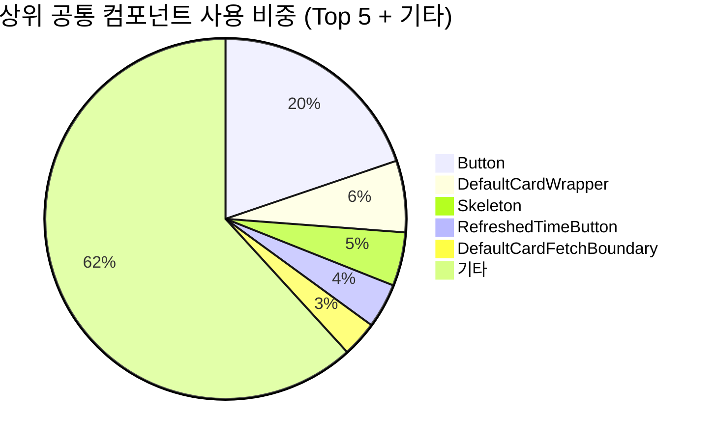
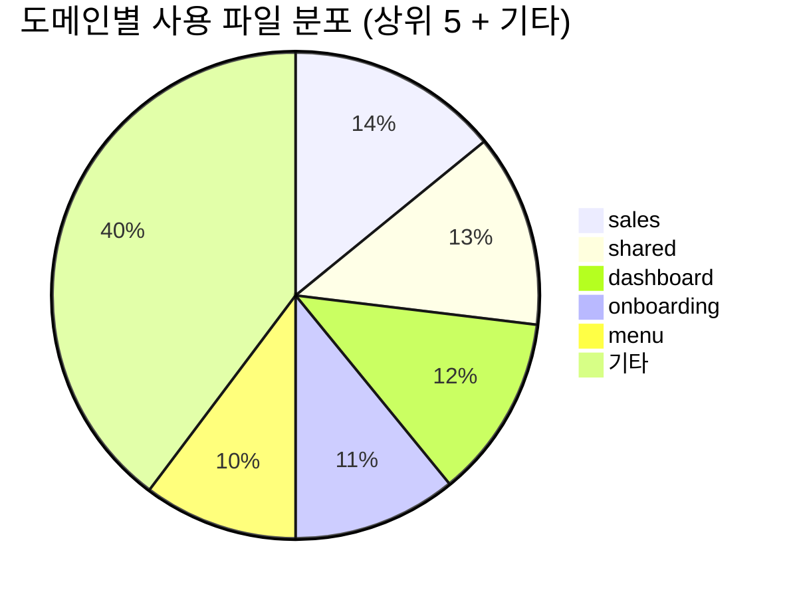
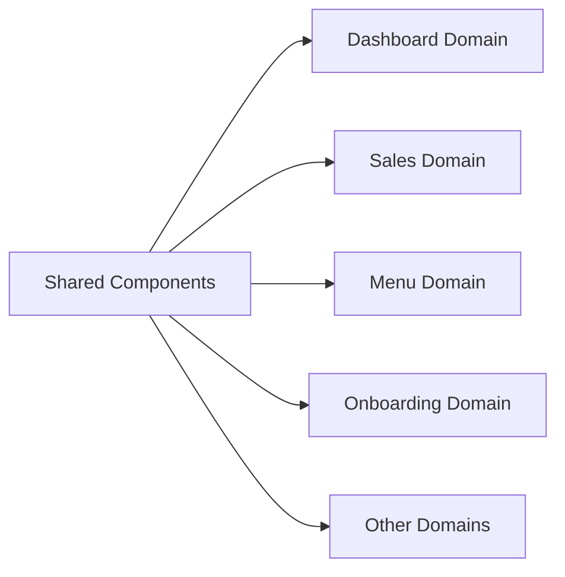
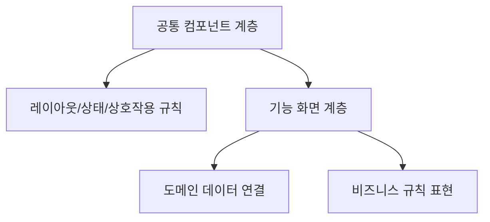
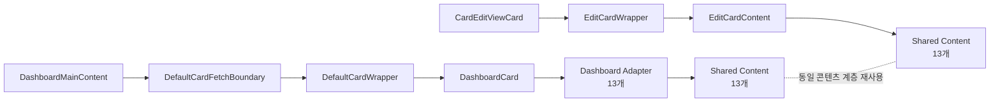
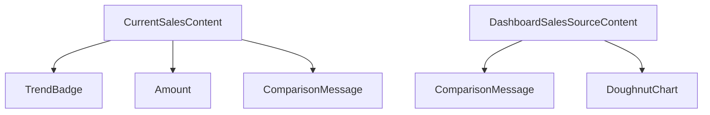
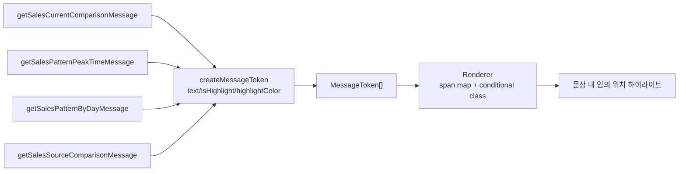

# [FE] 공통·도메인 특화 컴포넌트 재사용성 분석

## 한눈에 보기
- 공통 컴포넌트는 버튼, 카드 래퍼, 로딩/경계 계층을 중심으로 여러 화면에서 반복 재사용되고 있습니다.
- 적용 범위가 특정 기능에 고립되지 않고 대시보드, 매출, 메뉴, 온보딩 등 핵심 도메인 전반으로 확산되어 있습니다.
- 동일한 UI 역할을 기능 파일마다 다시 구현하지 않고 공유 계층에서 조합하는 구조가 자리 잡아, 유지보수와 확장에 유리한 형태를 보입니다.

 

공통 컴포넌트뿐 아니라 특정 도메인에서만 사용하는 컴포넌트도 재사용 가능한 구조로 유지해, 도메인 내부 중복까지 줄이는 전략을 적용했습니다.

## 1. 분석 과정
- 프론트엔드 소스 전반에서 공통 컴포넌트의 import/use 패턴과 실제 렌더링 흐름을 확인하는 스크립트를 통해 데이터를 추출했습니다.
- 검토 범위: 카드 매핑 정의 영역, 메인뷰 렌더링 체인, 편집뷰 렌더링 체인, 컴파운드 UI 구성 영역, 토큰 메시지 생성/렌더링 영역
- 자동 집계 결과는 주요 화면 코드를 다시 읽으며 교차 검증했습니다.
- 집계 과정에서 파싱 산출물 중 비정상 항목(컴포넌트명이 비어 있는 레코드)을 확인했고, 왜곡 방지를 위해 집계 대상에서 제외했습니다.

## 2. 기본 설계
### 2.1 재사용 중심 축
- 공통 컴포넌트 사용은 입력/액션 컴포넌트, 카드 래퍼 계층, 로딩/경계 컴포넌트에 집중됩니다.
- 화면별 개별 구현보다 "인터랙션 + 레이아웃 + 데이터"를 공유 계층으로 끌어올려 설계했습니다.

### 2.2 도메인 확산
- 재사용은 대시보드와 상세분석 도메인뿐 아니라, 온보딩, 환경설정 등으로 이어지며 일관된 UI 구성 방식을 형성합니다.
- 공통 컴포넌트가 특정 화면 최적화용이 아니라 제품 전반의 공통 문법으로 동작합니다.

### 2.3 중복 구현 회피
- 동일한 목적의 UI 블록을 각 기능 파일에서 반복 작성하지 않고, 공통 컴포넌트 조합으로 해결하는 패턴을 사용했습니다.
- 결과적으로 수정 지점이 분산되지 않아 변경 영향 범위와 회귀 위험을 줄이는 데 유리합니다.

### 2.4 효과: 구조 확장성과 운영 용이성
- 공통 컴포넌트 사용이 늘수록 화면 간 규칙 불일치가 줄고, 신규 화면에서도 기존 패턴을 재사용해 구현 속도를 안정적으로 유지할 수 있습니다.
- UI 정책 변경 시 수정 지점을 공유 계층에 집중할 수 있어, 운영 단계에서의 변경 비용과 누락 가능성을 낮출 수 있습니다.

## 3. 코드 감소율 및 생산성 지표
공통 컴포넌트를 사용하지 않았을 때(Raw Code)와 사용했을 때의 코드 구조를 비교합니다.
- 측정 방법:
- 반복적으로 등장하는 UI 책임(레이아웃 골격, 로딩/에러 처리, 액션 버튼, 상태 표기)을 공통 컴포넌트가 흡수하는지 확인합니다.
- 개별 화면에서는 기능 화면에서는 데이터 해석과 비즈니스 로직 중심으로 코드를 작성할 수 있는 생산성 구조를 확보합니다.

### 3.1 정량 지표 요약 표 (2026-02-26 집계 기준)
<table header-row="true">
<tr>
<td>지표</td>
<td>값</td>
<td>의미</td>
</tr>
<tr>
<td>공통 컴포넌트 수</td>
<td>63개</td>
<td>재사용 가능한 UI 자산 풀의 규모</td>
</tr>
<tr>
<td>총 사용 횟수</td>
<td>374회</td>
<td>실제 화면에서의 누적 재사용 빈도</td>
</tr>
<tr>
<td>사용 파일 수</td>
<td>156개</td>
<td>재사용 패턴이 확산된 코드 범위</td>
</tr>
<tr>
<td>적용 커버리지</td>
<td>39.4% (152/386)</td>
<td>스토리 제외 TSX 기준 적용 비율</td>
</tr>
<tr>
<td>컴포넌트당 평균 재사용</td>
<td>5.94회</td>
<td>개별 컴포넌트의 평균 활용도</td>
</tr>
<tr>
<td>중복 구현 회피 건수</td>
<td>311건</td>
<td>동일 UI를 기능별로 재작성하지 않은 횟수</td>
</tr>
<tr>
<td>추정 절감 LOC</td>
<td>2,488 ~ 6,220 LOC</td>
<td>반복 UI 블록 1건을 8~20 LOC로 가정한 범위</td>
</tr>
</table>

### 3.2 상위 재사용 컴포넌트 표
<table header-row="true">
<tr>
<td>순위</td>
<td>컴포넌트</td>
<td>사용 횟수</td>
<td>사용 파일 수</td>
</tr>
<tr>
<td>1</td>
<td>Button</td>
<td>74</td>
<td>37</td>
</tr>
<tr>
<td>2</td>
<td>DefaultCardWrapper</td>
<td>24</td>
<td>23</td>
</tr>
<tr>
<td>3</td>
<td>Skeleton</td>
<td>18</td>
<td>9</td>
</tr>
<tr>
<td>4</td>
<td>RefreshedTimeButton</td>
<td>15</td>
<td>15</td>
</tr>
<tr>
<td>5</td>
<td>DefaultCardFetchBoundary</td>
<td>12</td>
<td>11</td>
</tr>
</table>

### 3.3 도메인 분포 표
#### 사용 파일 수 기준 상위 도메인
<table header-row="true">
<tr>
<td>도메인</td>
<td>사용 파일 수</td>
</tr>
<tr>
<td>sales</td>
<td>22</td>
</tr>
<tr>
<td>shared</td>
<td>20</td>
</tr>
<tr>
<td>dashboard</td>
<td>19</td>
</tr>
<tr>
<td>onboarding</td>
<td>17</td>
</tr>
<tr>
<td>menu</td>
<td>16</td>
</tr>
</table>

#### 공통 컴포넌트 종류 수 기준 상위 도메인
<table header-row="true">
<tr>
<td>도메인</td>
<td>종류 수</td>
</tr>
<tr>
<td>ingredient</td>
<td>23</td>
</tr>
<tr>
<td>dashboard</td>
<td>22</td>
</tr>
<tr>
<td>shared</td>
<td>11</td>
</tr>
<tr>
<td>ai-chat</td>
<td>10</td>
</tr>
<tr>
<td>daily-report</td>
<td>10</td>
</tr>
</table>

### 3.4 지표 도식화
#### 상위 공통 컴포넌트 사용 비중

#### 도메인별 사용 파일 분포

- 해석:
- 입력/액션 계층(Button)과 카드 골격/경계 계층(DefaultCardWrapper, DefaultCardFetchBoundary)이 재사용 허브 역할을 수행합니다.
- 사용량은 sales, shared, dashboard 축에 집중되고, 종류 다양성은 ingredient, dashboard 축에서 높게 나타납니다.

## 4. 구조 도식
### 4.1 공통 컴포넌트 재사용 흐름

### 4.2 구현 책임 분리

## 5. 대시보드 지표카드 재사용
- 카드 코드 총 29개가 메인뷰와 편집뷰에서 100% 동일하게 매핑됩니다.
- 콘텐츠 컴포넌트는 13개를 공통 재사용하고, 뷰별 차이는 Wrapper/데이터 어댑터로 분리됩니다.
- 콘텐츠 레이어 기준 중복 절감 추정치는 50%입니다. (26개 가정 → 13개)
- 브리핑 문구는 `MessageToken[]` 기반으로 렌더링되어 하이라이트 위치가 달라도 동일 렌더러로 처리됩니다.

### 5.1 핵심 지표 표
<table header-row="true">
<tr>
<td>구분</td>
<td>지표</td>
<td>값</td>
</tr>
<tr>
<td>구조 일치</td>
<td>논리 카드 그룹 수</td>
<td>13</td>
</tr>
<tr>
<td>구조 일치</td>
<td>카드 코드 수</td>
<td>29 (sales 23, menu 6)</td>
</tr>
<tr>
<td>구조 일치</td>
<td>메인뷰-편집뷰 매핑 일치율</td>
<td>100.0% (29/29)</td>
</tr>
<tr>
<td>구조 일치</td>
<td>메인뷰 데이터 어댑터 수</td>
<td>13 (모두 `useSuspenseQuery` 사용)</td>
</tr>
<tr>
<td>중복 절감</td>
<td>편집창 콘텐츠 컴포넌트 수</td>
<td>13</td>
</tr>
<tr>
<td>중복 절감</td>
<td>메인뷰 어댑터 컴포넌트 수</td>
<td>13</td>
</tr>
<tr>
<td>중복 절감</td>
<td>콘텐츠 레이어 중복 회피 추정</td>
<td>13개</td>
</tr>
<tr>
<td>중복 절감</td>
<td>콘텐츠 레이어 중복 절감률 추정</td>
<td>50.0%</td>
</tr>
<tr>
<td>컴파운드/토큰</td>
<td>컴파운드 루트 컴포넌트 수</td>
<td>2</td>
</tr>
<tr>
<td>컴파운드/토큰</td>
<td>컴파운드 슬롯 수</td>
<td>5</td>
</tr>
<tr>
<td>컴파운드/토큰</td>
<td>컴파운드 슬롯 실제 사용 횟수</td>
<td>15회</td>
</tr>
<tr>
<td>컴파운드/토큰</td>
<td>토큰 메시지 생성 유틸 수</td>
<td>4</td>
</tr>
<tr>
<td>컴파운드/토큰</td>
<td>토큰 렌더링 컴포넌트 수</td>
<td>4</td>
</tr>
<tr>
<td>컴파운드/토큰</td>
<td>하이라이트 팔레트 수</td>
<td>3 (primary, negative, default)</td>
</tr>
</table>

### 5.2 카드 매핑 표
#### Sales 매핑 표 (23 codes / 9 groups)
<table header-row="true">
<tr>
<td>카드 코드 그룹</td>
<td>공통 콘텐츠</td>
<td>메인뷰 어댑터</td>
</tr>
<tr>
<td>`SLS_01_01, SLS_01_02, SLS_01_03`</td>
<td>`RealSalesContent`</td>
<td>`DashboardRealSalesCard`</td>
</tr>
<tr>
<td>`SLS_02_01, SLS_02_02, SLS_02_03`</td>
<td>`OrderCountContent`</td>
<td>`DashboardOrderCountCard`</td>
</tr>
<tr>
<td>`SLS_03_01, SLS_03_02, SLS_03_03`</td>
<td>`AveragePriceContent`</td>
<td>`DashboardAveragePriceCard`</td>
</tr>
<tr>
<td>`SLS_06_01, SLS_06_02, SLS_06_03`</td>
<td>`SalesTypeContent`</td>
<td>`DashboardSalesSourceSalesTypeCard`</td>
</tr>
<tr>
<td>`SLS_07_01, SLS_07_02, SLS_07_03`</td>
<td>`OrderChannelContent`</td>
<td>`DashboardSalesSourceOrderChannelCard`</td>
</tr>
<tr>
<td>`SLS_08_01, SLS_08_02, SLS_08_03`</td>
<td>`PayMethodContent`</td>
<td>`DashboardSalesSourcePayMethodCard`</td>
</tr>
<tr>
<td>`SLS_09_04, SLS_10_07, SLS_11_07`</td>
<td>`SalesTrendContent`</td>
<td>`DashboardSalesTrendCard`</td>
</tr>
<tr>
<td>`SLS_13_01`</td>
<td>`PeakTimeContent`</td>
<td>`DashboardPeakTimeCard`</td>
</tr>
<tr>
<td>`SLS_14_06`</td>
<td>`SalesByDayContent`</td>
<td>`DashboardSalesByDayCard`</td>
</tr>
</table>

#### Menu 매핑 표 (6 codes / 4 groups)
<table header-row="true">
<tr>
<td>카드 코드 그룹</td>
<td>공통 콘텐츠</td>
<td>메인뷰 어댑터</td>
</tr>
<tr>
<td>`MNU_01_01, MNU_01_04, MNU_01_05`</td>
<td>`MenuSalesRankingCardContent`</td>
<td>`DashboardMenuSalesRankingCard`</td>
</tr>
<tr>
<td>`MNU_03_01`</td>
<td>`TimeSlotMenuOrderCountCardContent`</td>
<td>`DashboardTimeSlotMenuOrderCountCard`</td>
</tr>
<tr>
<td>`MNU_04_01`</td>
<td>`IngredientUsageRankingCardContent`</td>
<td>`DashboardIngredientUsageRankingCard`</td>
</tr>
<tr>
<td>`MNU_05_04`</td>
<td>`PopularMenuCombinationCardContent`</td>
<td>`DashboardPopularMenuCombinationCard`</td>
</tr>
</table>

- 상세 매핑 기준은 별도 정리 문서로 관리합니다.

### 5.3 구조 도식
#### 메인뷰/편집뷰 재사용 구조

#### 컴파운드 패턴 구조

#### 토큰 하이라이팅 파이프라인

### 5.4 왜 유연한가
- 강조 구간이 문장 앞/중간/뒤 어디든 토큰 배열 순서만 바꾸면 됩니다.
- 하이라이트 색상 규칙은 상수로 분리되어 텍스트 생성 로직과 스타일 로직이 분리됩니다.
- 여러 메시지 유틸이 같은 렌더러를 사용해 UI 중복 분기와 수정 범위를 줄입니다.
- 도메인 전용 컴포넌트도 공통 인터페이스(카드 코드/데이터 어댑터/콘텐츠 계층)로 맞춰 관리해, 도메인 내부에서의 반복 구현도 구조적으로 줄일 수 있습니다.
