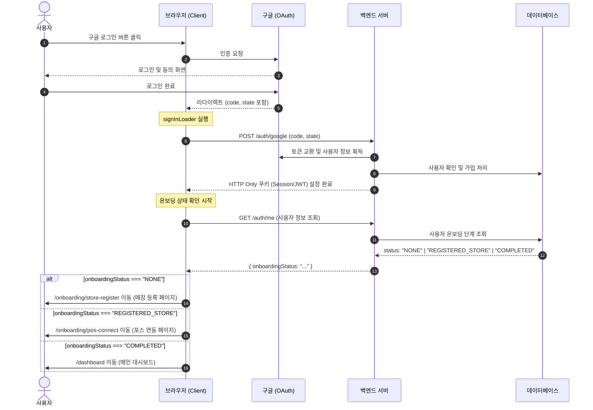
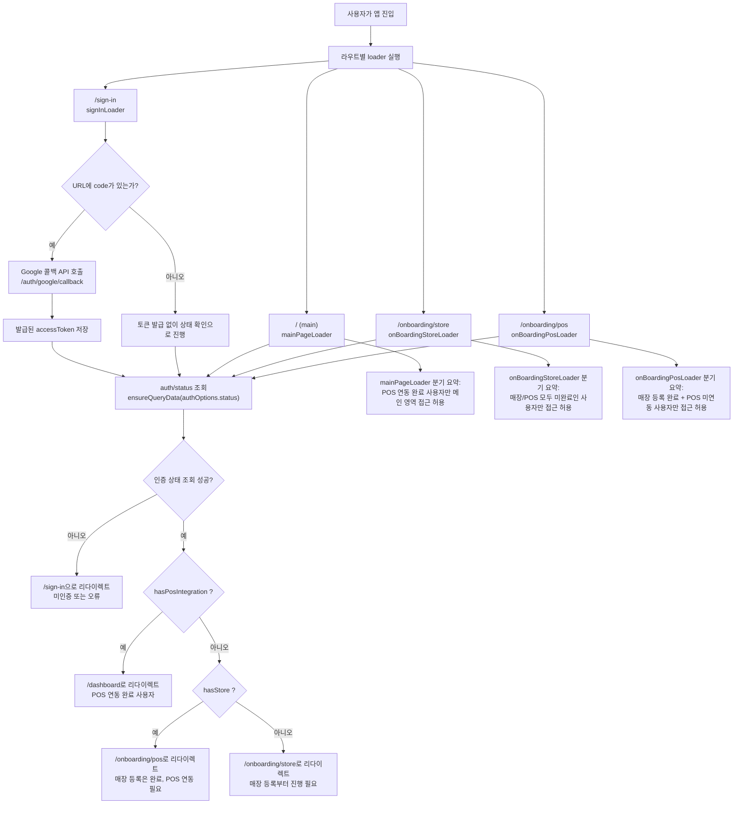

# 로그인 인증 개발 히스토리

> 참여자: 이영재, 정한울

## 현재 로직

1. `window.location.href = ${서버도메인}/auth/google?redirect_url={현재 사이트 도메인}`

   → fetch GET 메서드 사용 시 서버에서 구글 로그인 페이지로 redirect시키는 것 때문에 브라우저 CORS에 막혀서 `window.location.href`를 사용해서 브라우저에서 서버로 요청 후 구글 로그인 페이지로 redirect

2. 이후 구글 로그인
3. 구글 로그인 이후 → 서버에서 `{`/auth/google에서 보냈던 redirect_url`}/sign-in?state={}&code={}`으로 redirect시킴
4. `signInLoader` 에서 `state`, `code` ← oauth 2.0 토큰(구글에서 발급함) search param을 받아서 `/auth/google/callback` JWT 토큰 발급 api 호츨 ⇒ 로그인 성공 시 서버에서 쿠키에 refresh_token과 access token은 body로 리턴
5. 로그인 성

## 필요한 부분

- [ ] 로그인한 유저의 현재 정보를 알 수 있는 API 필요
  - 로그인 이후 해당 유저가 매장 등록을 안했는지
  - 매장 등록을 했지만 포스 연동을 안했는지
  - 포스 연동까지 완료했는지를 알아야 함

→ `/auth/me` 와 같이 유저 정보를 알아야 함

## 위 내역을 반영한 설계한 로그인 및 성공 이후 로직



## TODO

- [x] 리프레쉬 날리는 경우. 디테일하게 뽑기\

@이영재

- [x] 매장 등록에 성공했을 경우 `POST /auth/refresh` 요청 보내기
  - 처음 로그인 했을 때 액세스 토큰 페이로드에 매장 ID가 존재하지 않음
  - 매장 등록에 성공했을 때 기존의 액세스 토큰을 들고 있으면 매장이 없는 것으로 처리됨
  - 액세스 토큰 재발급 필요
- loader 수정하기

```tsx
import { redirect } from 'react-router-dom';

import type { QueryClient } from '@tanstack/react-query';

import { getAuthGoogle } from '@/services/auth';
import { authOptions } from '@/services/auth/options';
import { authToken } from '@/services/shared';

export const signInLoader = (queryClient: QueryClient) => async () => {
  const searchParams = new URLSearchParams(window.location.search);

  // google 로그인 이후 redirect_url의 query params 에서 code 와 state 를 추출
  const code = searchParams.get('code');

  // code 와 state 가 없으면 로그인 페이지로 바로 이동
  if (!code) {
    return;
  }

  // query params 초기화 (새로고침 없이 지우기 위해 replaceState 사용)
  history.replaceState({}, document.title, window.location.pathname);

  // google oauth토큰으로 jwt 토큰 발급
  await getAuthGoogle({
    code,
    redirectUrl: `${window.location.origin}/sign-in`,
  }).then(({ accessToken }) => {
    authToken.set(accessToken);
  });

  // 현재 유저 상태에 따라 redirect
  const { onboaradingStatus } = await queryClient.ensureQueryData(
    authOptions.me,
  );

  switch (onboaradingStatus) {
    case 'NONE':
      throw redirect('/onboarding/store');
    case 'REGISTERED_STORE':
      throw redirect('/onboarding/pos');
    case 'COMPLETED':
      throw redirect('/dashboard');
  }
};
```

## 최종 형태

rontend에서 라우트에 연결된 loader는 아래 4개로 구성

- signInLoader.ts
  - 코드

```tsx
import { redirect } from 'react-router-dom';

import type { QueryClient } from '@tanstack/react-query';

import { getAuthGoogle } from '@/services/auth';
import { authOptions } from '@/services/auth/options';
import { authToken } from '@/services/shared';

const getUserAuthStatus = async (queryClient: QueryClient) => {
  const data = await queryClient
    .ensureQueryData(authOptions.status)
    .catch(() => {
      return null;
    });

  if (!data) {
    return null;
  }

  if (data.hasPosIntegration) {
    return redirect('/dashboard');
  }

  if (data.hasStore) {
    return redirect('/onboarding/pos');
  }

  return redirect('/onboarding/store');
};

export const signInLoader = (queryClient: QueryClient) => async () => {
  const searchParams = new URLSearchParams(window.location.search);

  // google 로그인 이후 redirect_url의 query params 에서 code 와 state 를 추출
  const code = searchParams.get('code');

  // code 와 state 가 없으면 로그인 페이지로 바로 이동
  if (!code) {
    return await getUserAuthStatus(queryClient);
  }

  // query params 초기화 (새로고침 없이 지우기 위해 replaceState 사용)
  history.replaceState({}, document.title, window.location.pathname);

  // google oauth토큰으로 jwt 토큰 발급
  await getAuthGoogle({
    code,
    redirectUrl: `${window.location.origin}/sign-in`,
  }).then(({ accessToken }) => {
    authToken.set(accessToken);
  });

  return await getUserAuthStatus(queryClient);
};
```

- main-page-loader.ts
- onBoardingStoreLoader.ts
- onBoardingPosLoader.ts

라우트 연결 위치:

- AuthRoutes.tsx → signInLoader
- MainPageRoutes.tsx → mainPageLoader
- OnboardingRoutes.tsx → onBoardingStoreLoader, onBoardingPosLoader

## 전체 인증 플로우



## 참고 사이트

- [https://hochi-dev.tistory.com/8](https://hochi-dev.tistory.com/8)
- [https://medium.com/@sina.alizadeh120/repeating-failed-requests-after-token-refresh-in-axios-interceptors-for-react-js-apps-50feb54ddcbc](https://medium.com/@sina.alizadeh120/repeating-failed-requests-after-token-refresh-in-axios-interceptors-for-react-js-apps-50feb54ddcbc)
