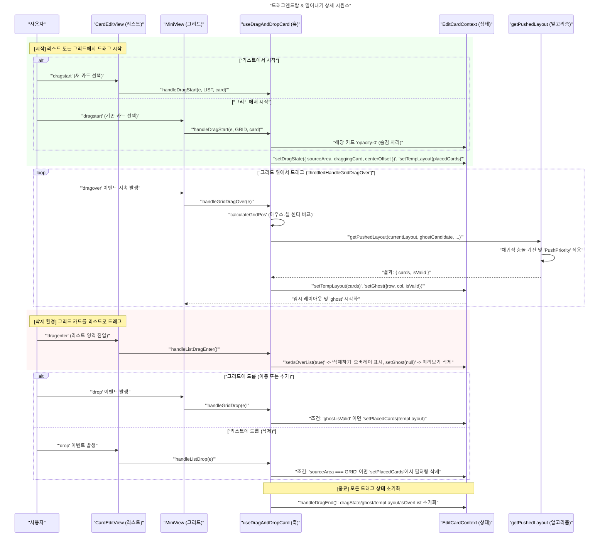

대시보드 탭 편집 시 드래그앤드랍을 구현하면서 겪은 트러블슈팅 및 스로틀링 관련 학습 내용입니다.
전체 코드는 `useDragAndDrop.ts` 파일에서 확인하실 수 있습니다.

  * [요구사항](#요구사항)
    + [그리드 및 데이터 구조](#그리드-및-데이터-구조)
    + [드래그 앤 드롭 매커니즘](#드래그-앤-드롭-매커니즘)
  * [HTML5 Draggable 관련 스타일링](#html5-draggable-관련-스타일링)
    + [커서 스타일링](#커서-스타일링)
    + [드래그 중인 요소 레이아웃에서 숨기기](#드래그-중인-요소-레이아웃에서-숨기기)
    + [드래그 이미지 스타일링](#드래그-이미지-스타일링)
  * [드래그 경계 인식](#드래그-경계-인식)
  * [스로틀링](#스로틀링)
    + [스로틀링(Throttling)이란?](#스로틀링throttling이란)
    + [this의 필요성](#this의-필요성)
    + [DragOver를 throttle하면 Drop 이벤트가 발생하지 않는다](#dragover를-throttle하면-drop-이벤트가-발생하지-않는다)
    + [리렌더링 시 throttle 인스턴스 재생성](#리렌더링-시-throttle-인스턴스-재생성)
    + [타이머 메모리 누수](#타이머-메모리-누수)
- [참고자료](#참고자료)

## 요구사항

화면 디자인을 기반으로 UX를 고려하여 정의한 요구사항 목록입니다.

### 그리드 및 데이터 구조

시스템의 기초가 되는 좌표계와 상태 구조를 정의합니다.

- **그리드 좌표계**: 3 x 3 행렬로 관리하며, 각 셀은 (x, y) 좌표(1 ~ 3)를 가집니다.
- **카드 객체 모델**:
    - `id`: 고유 식별자
    - `x, y`: 카드의 좌상단 시작 좌표
    - `w, h`: 카드의 너비와 높이 (e.g. 1x1, 1x2, 2x1)

### 드래그 앤 드롭 매커니즘

- **대상 선택**: 드래그 중인 카드의 중심점을 기준으로 가장 가까운 그리드 셀 (x, y)를 타겟으로 인식합니다.
- **미리보기(Ghost)**: 카드가 놓일 위치를 실시간으로 시각화하여 사용자에게 피드백을 줍니다.
- **외부 진입**
    - 카드 목록 뷰에서 그리드로 드래그할 때, 그리드 영역에 진입(`onMouseEnter`)하는 순간 새로운 카드 객체를 임시 생성합니다.
    - 그리드에서 카드 목록 뷰로 드래그할 때, 카드 목록 뷰 영역에 진입하면 놓아서 삭제하기 오버레이가 표시되고, 드롭 시 카드 객체가 그리드 뷰에서 완전히 삭제됩니다.



## HTML5 Draggable 관련 스타일링

### 커서 스타일링

처음에는 tailwindcss에서 `cursor: grab`와 `active:cursor-grabbing` 클래스를 적용했습니다. 그러나 `!important`를 사용해도 적용이 되지 않았습니다.
브라우저는 드래그가 시작되면 제어권을 OS와 브라우저의 드래그 엔진으로 넘깁니다. 이때 커서는 설정한 드래그 요소의 `e.dataTransfer.dropEffect`와 드롭 요소의`e.dataTransfer.effectAllowed`에 따라 브라우저가 강제로 결정합니다.

- `move`: 화살표 + 이동 아이콘
- `copy`: 화살표 + 플러스(+) 아이콘
- `link`: 링크 연결 아이콘
- `none`: 금지 아이콘
[playground에서 각각의 동작 확인하기](https://developer.mozilla.org/en-US/play?uuid=69c617c911e66efecbfe0236f4e1a1c6b5b0d8ee&state=rVTBbtswDP0VQsWABEjcpEAxwG0CbF0PA7pbb9MOqkTbamXJkGg3WdF%2FH2Q7jtOk7WWHwBH5SL73aOuFFVQalrJrpRuQRoSw4iy42ksMc%2BksCW3Rc7bmFuC%2BwIAgPAIVCD0KnjUVoHSWoUdLcC2dwrUwxj2jus0ylHR93sZii3aOVvshnK2vz5Vu1twOzzEXEj5H%2BoxLjzrNRXlXfUCkrz1BhM2YDIGlLDlyZMZtckQNXmLnZ62oSEEKIyfLxeILzOHCYzm9iskH5xX6FC6qDSgRClSQe7Ftc5VQSts8hUVy6bFsY6XwubYpLD2WsLji9pVbbs96PjNuz3bS29lKh8qIbQq516ptkIvqoGHPLhJ7261rESvnhGVlBOFcOlOXNqSwzPzuN9QdjP647miW0s2YfdzGy1uDgjNawYMR8qnlnhncpLCEBYia3NWB4JhrI8Lo3M41YRlSkGgJfRt%2FrAPpbNtuCy2NckfEOiYF6rygFC4X1eZI8hHq6%2BUOxWbsMb40mfMwkc4GgoOvAVwGv2MpZ9ZZ5GzWHaSrtsOhdM0%2BY7R9OoD9Gmdj4G6MiPADhDBm%2BF9bbTVpYfRfVG30z7RT0lGNwlagnKxLtJRIj4Lw1mA8TThTuuFs2lvfJIQbuukMhdWhzAGjvMhz8WAQVkC%2BxiEhlLpt0NKdDoQWfWzvRR5IeOJsBhOM2Sms1h1BgDaQKEHi3gsbMvQJtsO%2BdZNPcnjt6e4k5Ui9nu%2Fbn2oyuommiagqtOqm0EZNlG6mu72Pdrm%2FTbpF7pa43%2BB%2BfcPu%2Fp%2FH%2B%2FGf%2BeiaeFm%2Bb2Pl2%2BcPzERtaNINPOnxSPIRgU%2FdHa7X99xlM0YFlshSZuK3xF7%2FAQ%3D%3D&srcPrefix=%2Fen-US%2Fdocs%2FWeb%2FAPI%2FHTML_Drag_and_Drop_API%2FDrag_operations%2F)

*저는* `onDragStart`에서 `e.dataTransfer.effectAllowed = 'move';`를 설정했습니다.

`cursor: grabbing` 등의 스타일은 드래그 중인 원본 요소에만 적용됩니다. 이를 역이용하면, 투명한 `div`를 커서 위치에 두는 트릭으로 커서 스타일링을 변경할 수 있을 것 같습니다. 저는 과도하다고 생각하여 시도하지 않고 `move` 상태의 커서를 사용했습니다. 

### 드래그 중인 요소 레이아웃에서 숨기기


(^ 원본 요소가 그대로 남아있음)


(^ 원본 요소를 숨김)

드래그 중인 원본 요소가 그리드에 그대로 남아 있으면, 카드 충돌 알고리즘을 적용할 때 해당 위치에 존재하지 않은 카드임에도 존재하는 것처럼 보여 사용자 경험을 저해합니다. 하지만 요소를 `DOM`에서 완전히 제거하면 HTML5 Drag API의 특성상, 해당 요소의 Bitmap 복사본으로 드래그 이미지를 유지하기 때문에 드래그 이미지도 함께 사라지는 문제가 발생합니다.

드래그 시작 시(`handleDragStart`), 해당 카드 컴포넌트에 `opacity-0`를 부여하여 공간은 차지하되 사용자 눈에는 보이지 않게 처리할 수 있습니다. 드래그가 종료되면(`handleDragEnd`) 상태를 복구합니다. `isDragging` 상태를 만들어 구현했습니다.

### 드래그 이미지 스타일링

드래그 되는 요소의 원본 이미지는 위와 같이 지울 수 있고, 드래그 이미지 자체는 `e. dataTransfer. setDragImage`를 통해 바꾸거나 없앨 수 있습니다. 이번에는 레이아웃과 동일한 드래그 이미지를 사용하면 돼서 사용하진 않았습니다.


(^ border-radius가 적용되지 않은 모습)

추가로 저는 `border-radius`가 적용되지 않고 직사각형으로 배경색까지 표시되는 문제가 있었습니다. 이는 `translate-x-0` 속성을 주는 트릭으로 해결할 수 있습니다.

## 드래그 경계 인식

카드 리스트 뷰 위로 드래그 시 "삭제 오버레이"를 띄울 때, 오버레이가 마운트되면서 기존 리스트 뷰의 `dragLeave`와 오버레이의 `dragEnter`가 충돌하여 화면이 깜빡이는 현상이 발생했습니다.

특정 경계를 넘어서 나가는 `dragLeave` 이벤트에서만 동작하도록 하기 위해선 어떻게 해야 할까요?

결론적으로 `relatedTarget`을 통해서 특정 영역 안팎으로의 진입/이탈을 판별할 수 있었습니다. `relatedTarget`은 `MouseEvent` 객체의 속성 중 하나인데 커서가 들어오거나 나갈 때 직전의 요소를 담고 있습니다.

리스트 컴포넌트 `ListView`에서 발생한 `dragLeave`의 `relatedTarget`이 `ListView`에 포함되지 않는다면 `ListView`를 기준으로 밖으로 나가는 `dragLeave` 이벤트라는 것을 알 수 있습니다. `relatedTarget`이 경계로 지정한 요소에 포함된다면 경계에서 발생한 이벤트가 아니기 때문에 무시할 수 있습니다.


```jsx
 const handleListDragLeave = (e: React.DragEvent) => {
    if (!e.currentTarget.contains(e.relatedTarget as Node)) {
      // 리스트 영역 기준 외부로 나가는 이벤트인 경우
      setIsOverList(false);
    }
  };
```

다만 Safari 등 일부 브라우저에서는 `DragEvent` 내의 `relatedTarget`이 `null`로 반환되는 호환성 문제가 있습니다. 이를 해결하기 위해 찾아보다가 `window.document.elementFromPoint`라는 Window API를 발견했고 이를 Fallback으로 활용했습니다.

`dragleave` 이벤트에 대해서 Safari는 아래 코드로 간단하게 해결할 수 있습니다. (`dragenter` 이벤트까지 처리하려면 참고자료 란의 블로그를 참고해주세요.)

```tsx
// console.log('handleGridDragLeave');
const relatedTarget =
  e.relatedTarget || window.document.elementFromPoint(e.clientX, e.clientY);
    
  if (!e.currentTarget.contains(relatedTarget as Node)) {
    setGhost(null);
  }
};
```

## 스로틀링

### 스로틀링(Throttling)이란?

- 디바운싱(Debouncing): 일정 시간 동안 이벤트가 발생하지 않을 때까지 기다렸다가 로직을 수행합니다. (e.g. 타이핑이 끝난 후 한 번만 검색 API 호출)
- 쓰로틀링(Throttling): 일정 시간마다 한 번씩만 로직을 수행합니다. (e.g. 드래그를 계속 움직여도 dragOver는 200ms마다 한 번씩만 갱신)

### this의 필요성

처음 throttle 코드 작성할 때는 [es-toolkit](https://github.com/toss/es-toolkit/blob/main/src/function/throttle.ts)을 참고했습니다.

```tsx
/**
 * @param fn - 스로틀링 할 함수
 * @param throttleMs - 스로틀링 간격 (millisecond 단위), 기본값 50ms
 */
export function throttle<T extends unknown[]>(
  fn: (...args: T) => void,
  throttleMs = 50,
): (...args: T) => void {
  let pendingAt = 0;
  let timeoutId: ReturnType<typeof setTimeout> | null = null;
  let savedArgs: T | null = null;
  let savedThis: unknown = undefined;

  return function throttled(this: unknown, ...args: T) {
    const now = Date.now();
    const remain = throttleMs - (now - pendingAt);

    // 이전 호출이 아직 유효한 경우, 마지막 인자와 this를 저장
    // eslint-disable-next-line @typescript-eslint/no-this-alias
    savedThis = this;
    savedArgs = args;

    // 실행
    if (remain <= 0 || pendingAt === 0) {
      if (timeoutId) {
        clearTimeout(timeoutId);
        timeoutId = null;
      }
      pendingAt = now;
      fn.apply(this, args);
      savedArgs = null;
      savedThis = undefined;
    }
    // 타이머 설정
    else if (!timeoutId) {
      timeoutId = setTimeout(() => {
        pendingAt = Date.now();
        timeoutId = null;
        if (savedArgs) {
          fn.apply(savedThis, savedArgs);
          savedArgs = null;
          savedThis = undefined;
        }
      }, remain);
    }
  };
}

```

위 코드에서 `fn.apply(this, args)`는 `args`(인자 배열)과 `this`(컨텍스트)를 가지고 `fn`(스로틀링 되는 함수)를 호출해줍니다. 

<details>

<sumamry>왜 `this`를 넘겨줘야 할까요?</summary>
    
    JavaScript에서 함수는 어디서 호출하느냐에 따라 `this`가 계속 바뀝니다. 따라서 `savedThis`를 저장해두는 건 객체 메서드를 쓰로틀링 할 때 `setTimeout`내에서 함수 호출자를 잃어버리지 않기 위해서입니다. 
    
    예를 들어, 객체 안에서 `throttle`을 쓴다고 가정해 봅시다.
    
    ```jsx
    const dashboardManager = {
      name: "메인 대시보드",
      updatePosition: function(row, col) {
        console.log(`${this.name}의 위치를 ${row}, ${col}로 업데이트!`);
      }
    };
    
    // 스로틀 적용
    dashboardManager.throttledUpdate = throttle(dashboardManager.updatePosition, 100);
    ```
    
    이때 `dashboardManager.throttledUpdate(1, 1)`을 실행하면:
    
    1. `throttled` 함수 내부의 `this`는 호출자인 `dashboardManager`가 됩니다.
    2. 하지만 `fn.apply(this, args)`를 쓰지 않고 그냥 `fn(args)`라고만 하면, `updatePosition` 함수는 어느 객체에 소속되어 있었는지를 잊어버립니다.
    3. 결과적으로 `this.name`을 찾지 못해 에러가 나거나 `undefined`가 뜹니다.

</details>

최신 JavaScript(ES6+)에서는 `apply` 대신 `...`를 써서 `args` 배열을 펼치는 것을 더 직관적으로 표현할 수 있습니다. 또, 팀에서 모든 함수는 화살표 함수로 작성하기로 코드 스타일을 통일했기 때문에 `this`를 사용할 필요가 없었습니다. (화살표 함수는 `this`를 가지지 않습니다.)

```jsx
// 원래 코드
fn.apply(this, args);

// 변경한 코드
fn(...args);
```

### DragOver를 throttle하면 Drop 이벤트가 발생하지 않는다

```tsx
  const handleGridDragOver = throttle((e: React.DragEvent) => {
	    e.preventDefault();
	    const { row, col } = calculateGridPos(e.clientX, e.clientY);
	    ... 
	  },
	  200
	);
```

`DragOver` 핸들러에 `throttle`을 적용했는데, `handleGridDrop`이 호출되지 않는 문제가 발생했습니다.

React의 메모리 풀링(Pooling, 이벤트 핸들러가 종료되면 이벤트 객체의 모든 속성은 `null`로 초기화되어 메모리 풀로 돌아감)은 17버전부터 사라졌습니다. 다만, React의 `SyntheticEvent`는 메모리에 남아있어도, 그 안에 들어있는 실제 브라우저의 `Native Event`는 상태가 변할 수 있습니다.

브라우저는 이벤트 핸들러가 Call Stack에서 실행되는 동안(즉시) 답변을 듣길 원합니다. 이벤트가 전파되고 핸들러가 종료되면, 브라우저는 해당 이벤트를 '처리 완료' 상태로 마킹합니다. 

이로 인해 `throttle`에 의해 `e.preventDefault()`가 지연 호출되면, 브라우저 입장에서 이벤트 핸들러가 끝날 때까지 `e.preventDefault()`가 호출되지 않았으니, 답변을 듣지 못한 것으로 간주하고 자체적인 기본 동작인 Drop 금지를 수행합니다.

또한, 일부 브라우저 엔진은 성능 최적화를 위해 이벤트가 끝난 뒤 해당 `Native Event` 객체의 내부 데이터를 메모리에서 해제하거나 변경할 수 있습니다. 따라서, React가 쥐고 있는 `e` 객체는 살아있지만, 그 `e`가 가리키고 있는 실제 브라우저의 정보(Native Event)는 끊기거나 값이 변질(Stale)됩니다.

따라서, 이벤트 객체를 throttled 함수에 통째로 넘기지 말고, 이벤트에서 필요한 원시 값(`clientX`, `clientY`)과 즉시 호출해야 할 `e.preventDefault()`는 동기적으로 처리한 뒤, `throttled`된 코어 함수에는 원시 값만 전달하도록 변경했습니다.

```tsx
  const handleGridDragOverFn = (clientX: number, clientY: number) => {
    ...
  };
  
  const throttledHandleGridDragOver = throttle(handleGridDragOverFn, 200);
  
  const handleGridDragOver = (e: React.DragEvent) => {
    e.preventDefault();
    const clientX = e.clientX;
    const clientY = e.clientY;

    throttledHandleGridDragOver(clientX, clientY);
  };
```

### 리렌더링 시 throttle 인스턴스 재생성

위와 같이 코드를 구현했을 때, 상태가 바뀌어 컴포넌트가 리렌더링 될 때마다 새로운 `throttle` 인스턴스가 생성되는 문제가 있었습니다.

`throttledHandleGridDragOver = throttle(handleGridDragOverFn, 100)`가 Hook body(렌더 경로)에서 실행되기 때문에, 훅이 재실행될 때마다 `handleGridDragOverFn`이 새 함수로 재선언되고, 그에 따라 `throttle(...)`도 새로 호출되어 새 인스턴스가 만들어지기 때문입니다.

매번 새로운 `throttle` 인스턴스가 생성되면서, 내부의 `pendingAt`이나 `timeoutId`가 초기화되어 스로틀링 주기(`throttleMs`)를 지키지 못하고 모든 요청을 실행하게 됩니다.

따라서, `useRef`를 사용하여 `throttled` 인스턴스를 고정하고 최신 상태를 참조하도록 변경했습니다.

```jsx
 // 원래 코드
 const throttledFn = throttle(handleDrag, 100); // 리렌더링마다 초기화됨
 
 // 변경된 코드
 // 1. 실제 실행될 로직(fn)의 최신 참조를 보관
  const handleGridDragOverRef = useRef(handleGridDragOverFn);
  // 2. 렌더링 시마다 최신 함수로 업데이트 
  useEffect(() => {
    handleGridDragOverRef.current = handleGridDragOverFn;
  }, [handleGridDragOverFn]);
	// 3. 스로틀 인스턴스 자체를 useRef로 고정
  const handleGridDragOverThrottled = useRef(
    throttle(
      (x: number, y: number) => handleGridDragOverRef.current(x, y),
      100,
    ),
  );
```


각 이벤트 핸들러의 최상단에서 콘솔 로그를 찍어보면 스로틀링이 잘 작동하는 모습을 볼 수 있습니다.

이후, 위 코드를 기반으로 다른 함수들에서 재사용 될 수 있도록 `useThrottle` 커스텀 훅을 구현했습니다.

```jsx
import { useEffect, useMemo, useRef } from 'react';

import { throttle } from '@/utils/shared';

/**
 * @param fn - 스로틀링 할 함수
 * @param throttleMs - 스로틀링 간격 (millisecond 단위), 기본값 50ms
 */
export function useThrottle<T extends unknown[]>(
  fn: (...args: T) => void,
  throttleMs = 50,
) {
  // 실행할 함수의 최신 참조
  const fnRef = useRef(fn);
  useEffect(() => {
    fnRef.current = fn;
  }, [fn]);

  // 스로틀 인스턴스를 한 번만 생성
  const throttledFn = useMemo(() => {
    // eslint-disable-next-line react-hooks/refs
    return throttle((...args: T) => {
      fnRef.current(...args);
    }, throttleMs);
  }, [throttleMs]);

  // 타이머 클리어
  useEffect(() => {
    return () => throttledFn.cancel();
  }, [throttledFn]);

  return throttledFn;
}

```

### 타이머 메모리 누수

`setTimeout`때문에 이전 throttled 인스턴스의 타이머가 남아있을 수 있습니다. 따라서, 컴포넌트 언마운트 이후에 예약된 콜백이 실행되어 메모리 누수나 setState on unmounted component 경고가 발생할 수 있습니다.

따라서 `useEffect`에서 언마운트 시 타이머를 클리어 할 수 있도록 `throttled`에 `cancel` 함수를 정의했습니다.

```jsx
type ThrottledFunction<T extends unknown[]> = ((...args: T) => void) & {
  cancel: () => void;
};
export function throttle<T extends unknown[]>(
  fn: (...args: T) => void,
  throttleMs = 50,
): ThrottledFunction<T> {
  
  // ...
  
  // 타이머 클리어
  throttled.cancel = () => {
    if (timeoutId) {
      clearTimeout(timeoutId);
      timeoutId = null;
    }
    pendingAt = 0;
    savedArgs = null;
  };

  return throttled;
}
```

```jsx
// 사용
useEffect(() => {
  const throttled = handleGridDragOverThrottled.current;
  return () => {
    throttled.cancel();
  };
}, []);
```

# 참고자료

https://kimjeongwonn.com/2023/Drag-and-Drop%EC%9D%84-%ED%99%9C%EC%9A%A9%ED%95%9C-%ED%8C%8C%EC%9D%BC%EC%B2%A8%EB%B6%80-%EA%B8%B0%EB%8A%A5-%EA%B0%9C%EB%B0%9C%EA%B8%B0

https://developer.mozilla.org/en-US/docs/Web/API/MouseEvent/relatedTarget

https://github.com/toss/es-toolkit/blob/main/src/function/throttle.ts