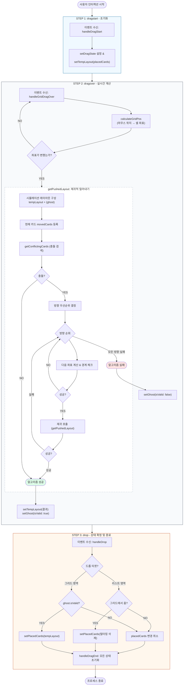

관련 코드 `useDragAndDrop.ts` `editCard.ts`

- [상태 관리](#상태-관리)
  * [데이터 구조 전환: 2차원 행렬 → 객체 배열](#데이터-구조-전환-2차원-행렬-객체-배열)
  * [placedCards, tempLayout 상태 관리 체계](#placedcards-templayout-상태-관리-체계)
- [충돌 검사](#충돌-검사)
  * [AABB (Axis-Aligned Bounding Box)](#aabb-axis-aligned-bounding-box)
- [충돌 진입 방향 판별](#충돌-진입-방향-판별)
  * [마우스 위치가 아닌 카드 중심점 기준의 좌표 계산](#마우스-위치가-아닌-카드-중심점-기준의-좌표-계산)
  * [벡터 기반 진입 방향 판별](#벡터-기반-진입-방향-판별)
- [재귀적인 충돌 회피](#재귀적인-충돌-회피)
  * [getPushedLayout의 작동 단계](#getpushedlayout의-작동-단계)
  * [Visited 패턴을 통한 무한 재귀 방지](#visited-패턴을-통한-무한-재귀-방지)
- [경계 및 공간 부족 예외 처리 (Boundary Logic)](#경계-및-공간-부족-예외-처리-boundary-logic)
- [**전체 플로우 차트**](#전체-플로우-차트)
- [참고자료](#참고자료)


## 상태 관리

### 데이터 구조 전환: 2차원 행렬 → 객체 배열

기존의 추가/삭제 기능만 존재하던 환경에서는 각 셀에 카드가 존재하는지 여부만 주로 검증했기 때문에 `grid: MetricCardCode[][]`와 같은 **2차원 행렬(Matrix)** 방식을 사용했습니다. 

그러나 DnD를 도입하며 다음과 같은 한계에 부딪혔습니다.

- **충돌 계산의 복잡성:** 특정 좌표에 위치한 카드의 전체 점유 영역을 행렬에서 실시간으로 파악하고 이동시키기에 연산 비용이 높습니다.
- **재귀적 이동 처리의 어려움:** 카드가 밀려날 때 인접한 다른 카드들을 연쇄적으로 이동시키는 로직을 행렬 구조 내에서 직관적으로 표현하기 어렵습니다.

이를 해결하기 위해 `Context`에서 관리하는 데이터 구조를 좌표 기반의 객체 리스트(`placedCards: DashboardCard[]`)로 변경하였습니다. 각 객체는 자신의 `(rowNo, colNo)` 좌표와 크기 정보 `(sizeX, sizeY)`를 직접 보유함으로써 충돌 감지와 이동 연산의 효율성을 극대화했습니다.

### **placedCards, tempLayout 상태 관리 체계**

사용자에게 실시간 피드백을 제공하되, `drop`을 하기 전까지는 충돌로 계산되는 임시 상태와 실제 상태를 분리하기 위해 상태를 3개로 분리했습니다.

| **상태 구분** | **설명** |
| --- | --- |
| ~`placedCards`~`realLayout` | 그리드에 실제로 배치 완료된 카드의 **최종 확정 상태**입니다. |
| ~`tempLayout`~`simulatedLayout` | 드래그 중 밀어내기 로직이 적용된 **시뮬레이션(예측) 레이아웃**입니다. |
| `ghost` | 사용자가 현재 잡고 있는 카드의 위치와 배치 가능 여부(isValid)를 보여주는 가이드입니다. |

**비가역적 상태 업데이트**

기존에는 `handleGridDragOver`에서 원본 `placedCards`를 기반으로 매번 새로운 `getPushedLayout`을 계산했습니다.

```jsx
const handleGridDragOver = (e) => {
  // 매 프레임마다 '고정된 원본'에서 다시 충돌 계산 시작
  const result = getPushedLayout(placedCards, draggingCard, ...);
  
  // 계산된 결과는 오직 '미리보기(tempLayout)'에만 저장됨
  setTempLayout(result.layout); 
};
```

이로 인해 카드 A를 밀어서 카드 B를 치워냈더라도, 드래그 중인 마우스가 조금만 움직여 카드 A와의 충돌이 해제되는 순간 카드 B가 원래 자리로 튕겨 돌아갑니다. `getPushedLayout` 함수가 매 프레임마다 원본(`placedCards`)을 참조하여 계산을 수행했기 때문입니다. 이로 인해 사용자에게 배치에 대한 불안정성으로 느껴진다는 피드백이 있었습니다.

따라서 사용자가 카드를 밀어내어 배치를 변경했을 때, 그 변화가 유지되도록 **'비가역적 업데이트'** 로직을 도입했습니다.

먼저 `dragstart` 이벤트에서 `tempLayout`은 `placedCards`로 초기화됩니다. 그리고 `dragover`에서 유효한 밀어내기 결과(`result.isValid === true`)가 확인되면 `tempLayout`에 `result`를 저장합니다. `getPushedLayout`은 이렇게 저장된 `tempLayout`을 기준으로 계산을 합니다.

```jsx
const handleGridDragOver = (e) => {
  // 현재 보여지는 미리보기 레이아웃을 기반으로 충돌 계산 시작
  const result = getPushedLayout(tempLayout, draggingCard, ...);
  ...
  setTempLayout(result.layout); 
};
```

이렇게 되면 충돌 직후 마우스를 다른 곳으로 이동하더라도 이미 밀려난 카드들은 변경된 위치를 유지합니다.

## 충돌 검사

### AABB (Axis-Aligned Bounding Box)

생각보다 헷갈리는 개념이라 그림과 함께 정리해두었습니다


x축 기준으로 두 카드가 겹치지 않는 두 가지 케이스

- A의 오른쪽 경계가 B의 왼쪽 경계보다 좌측에 위치해 있습니다.
- B의 오른쪽 경계가 A의 왼쪽 경계보다 좌측에 위치해 있습니다.

```math
$A_{x_{max}}<B_{x_{min}} || B_{x_{max}}<A_{x_{min}}$
```

이 전체를 부정하면 두 카드는 겹친다.

```math
A_{x_{max}} \ge B_{x_{min}} \&\& B_{x_{max}} \ge A_{x_{min}}
```


x축과 y축에 대해서 각각 두 번 검사하면 두 카드가 겹치는 경우는 다음과 같습니다다.

```math
(A_{x_{max}} \ge B_{x_{min}} \&\& B_{x_{max}} \ge A_{x_{min}}) \&\& (A_{y_{max}} \ge B_{y_{min}} \&\& B_{y_{max}} \ge A_{y_{min}})
```

```jsx
const isOverlapping = (
  row1: number,
  col1: number,
  width1: number,
  height1: number,
  row2: number,
  col2: number,
  width2: number,
  height2: number,
) => {
  const xStart1 = col1; // 첫번째 카드의 시작 x좌표
  const xEnd1 = col1 + width1 - 1; // 첫번째 카드의 끝 x좌표
  const yStart1 = row1; // 첫번째 카드의 시작 y좌표
  const yEnd1 = row1 + height1 - 1; // 첫번째 카드의 끝 y좌표

  const xStart2 = col2;
  const xEnd2 = col2 + width2 - 1;
  const yStart2 = row2;
  const yEnd2 = row2 + height2 - 1;

  const isYOverlapping = yEnd1 >= yStart2 && yEnd2 >= yStart1;
  const isXOverlapping = xEnd1 >= xStart2 && xEnd2 >= xStart1;

  return isYOverlapping && isXOverlapping;
};
```

## **충돌 진입 방향 판별**

### 마우스 위치가 아닌 카드 중심점 기준의 좌표 계산

마우스 커서의 좌표를 사용하니 큰 카드를 드래그할 때 Ghost가 카드의 위치를 따라가기보다 커서의 위치에 따라 결정되어 사용자 경험이 저해되었습니다. 

이를 방지하기 위해 카드의 중심점을 기준으로 가장 가까운 그리드 셀을 계산하도록 변경했습니다.

`dragStart` 시점에서 마우스 클릭 지점과 카드 중심점 사이의 거리를 계산하여 `DragState` 상태에 `offsetX`, `offsetY`로 저장합니다. 그리고 `mousemove` 시 실시간 마우스 좌표에서 `centerOffset`을 역산하여 카드의 실제 중심 좌표를 구하고, 이를 기준으로 그리드 셀과의 거리를 계산해 가장 가까운 위치에 Ghost를 배치합니다.

```jsx
const handleDragStart = (e: React.DragEvent, ...) => {
	...
  const cardRect = e.currentTarget.getBoundingClientRect();
  setDragState({
    centerOffset: {
      // 카드 중심에서 마우스 포인터까지의 상대 좌표 (픽셀 단위)
      x: e.clientX - cardRect.left - cardRect.width / 2,
      y: e.clientY - cardRect.top - cardRect.height / 2,
    },
    ...
  });
};
```

이로서 카드의 실제 중심점을 기준으로 그리드 셀 중심과의 거리를 계산하여 안정적으로 `calculateGridPos`를 수행합니다. 이때 격자 형태를 따라 이동하므로 맨해탄 거리로 계산합니다.

### **벡터 기반 진입 방향 판별**

사용자가 어떤 카드를 오른쪽 방향으로 밀어내고자 왼쪽에서 오른쪽으로 진입합니다. 그런데 기존 코드에서는 하드코딩된 상 → 하 → 좌 → 우 순서대로 가능한 위치에 카드를 밀어냅니다. 이 방식은 사용자의 멘탈모델과 일치하지 않아 사용자 경험 저해됩니다.

다만, `ghost`의 위치가 확정된 이후에야 충돌 회피 알고리즘이 실행되기 때문에, 충돌 이후에는 두 카드의 좌표값이 겹쳐 진입 방향을 알 수 없게 됩니다.

따라서, `ghost`의 위치가 변화하여 충돌 회피 알고리즘이 실행되기 직전, `dragover` 핸들러에서 마우스 좌표값을 기준으로 드래그 중인 요소의 중심점 (`draggingCenterX`, `draggingCenterY`)를 계산합니다.

```jsx
// 드래그 중인 카드의 중심점 (픽셀단위)
const cardRect = gridRef.current.getBoundingClientRect();
const draggingCenterX = clientX - cardRect.left - dragState.centerOffset.x;
const draggingCenterY = clientY - cardRect.top - dragState.centerOffset.y;
```

이후 호출된 충돌 알고리즘 `getPushLayout`은 `getPushDirectionPriority`를 호출하는데, 여기에서 `ghost` 위치가 변하기 직전의 실시간 픽셀 좌표 차이 dx, dy를 분석하여, 더 큰 비율을 가진 축의 반대 방향을 최우선 밀어내기 후보로 설정합니다. e.g. 왼쪽에서 오른쪽으로 진입 시 dx의 비중이 높으므로 '우측으로 밀기'를 최우선 순위로 결정합니다. (RIGHT, DOWN, UP, LEFT 순)

## **재귀적인 충돌 회피**

큰 카드가 좁은 공간으로 진입할 때 여러 개의 작은 카드가 순차적으로 밀려나는 도미노 현상을 구현하기 위해 재귀 알고리즘을 사용합니다.

### getPushedLayout의 작동 단계

1. 현재 레이아웃에서 충돌하는 카드들을 식별합니다 (`getConflictingCards`).
2. 결정된 우선순위 방향으로 드래그 중인 요소의 크기만큼 충돌 카드의 이동을 시뮬레이션합니다.
3. 이동된 카드가 새로운 위치에서 또 다른 충돌을 일으키면, 해당 카드를 대상으로 `getPushedLayout`을 재귀 호출합니다.
4. 만약 카드가 그리드 경계를 이탈하거나 더 이상 밀 공간이 없다면, 해당 방향 시도를 무효화하고 다음 우선순위 방향을 시도합니다.
5. 유효한 위치를 찾으면 재귀를 멈춥니다. 재귀를 모두 돌았음에도 유효하지 않으면 예외로 처리합니다. 

### Visited 패턴을 통한 무한 재귀 방지

카드가 서로를 밀어내다 다시 자기 자신을 밀게 되는 순환 참조가 발생했습니다. 이를 방지하기 위해 `movedIds` (Set)를 사용합니다. 한 번 밀려난 카드는 해당 프레임 내에서 다시 계산하지 않도록 합니다.

## **경계 및 공간 부족 예외 처리 (Boundary Logic)**

- 모든 카드의 이동은 그리드 좌표계 내로 제한됩니다.
- **Non-Rollback 전략**: 자리가 부족하더라도 이전 상태로 롤백하지 않고 가능한 지점까지 최대한 밀어붙여 물리적 조작감을 유지합니다.
- **Ghost 피드백:** 최종적으로 모든 밀어내기를 시도했음에도 불구하고 드래그 중인 카드가 다른 카드와 겹쳐 있다면, `Ghost` 카드의 상태를 `isValid: false`로 변경하고 빨간색 가이드를 표시하여 배치가 불가능함을 알립니다.

이후 `isValid` 상태에서 `drop`을 하거나 리스트 뷰에 `drop`을 해서 그리드 뷰의 변경이 취소되면 `setPlacedCards(tempLayout)`을 실행하지 않으므로서 모든 시뮬레이션 결과가 롤백 됩니다.

## 전체 플로우 차트



## 참고자료

https://forsave.tistory.com/148

https://examples.dndkit.com/

(충돌 회피 UX는 안드로이드 홈 위젯을 참고했습니다.)