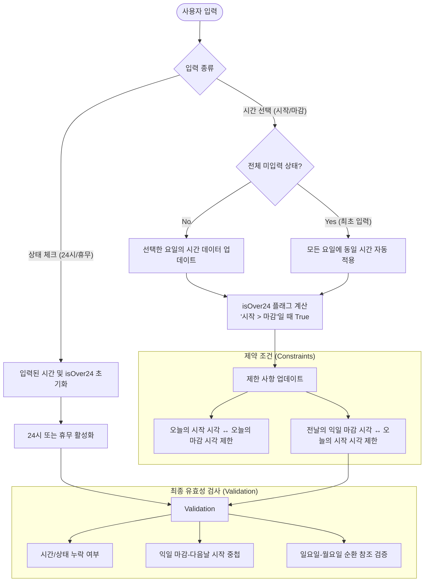
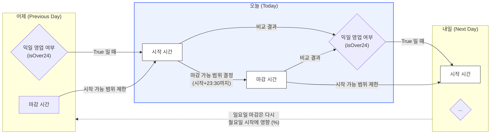

# 매장 영업 마감 시간 선택 기능

> 참여자: 이영재

00:00 ~ 24:00에서 00:00 ~ 23:30만 보이게 설정

서로 영향을 미치는 관계

월 시작 → 월 마감

월 마감 → 화 시작

화 시작 → 화 마감

화 마감 → 수 시작

수 시작 → 수 마감

수 마감 → 목 시작

목 시작 → 목 마감

목 마감 → 금 시작

금 시작 → 금 마감

금 마감 → 토 시작

토 시작 → 토 마감

토 마감 → 일 시작

일 시작 → 일 마감

일 마감 → 월 시작

~~24시간 매장 → 00:00 ~ 00:00 선택 가능하게 처리~~

→ 24시 checkbox 체크여부로 결정되게끔

## 매장 시작 시간의 HH < 매장 종료 시작의 HH인 경우

ex) 05:30 → 09:30, 02:30 → 11:30, 16:30 → 22:30

해당 요일에 시작해서 해당 요일에 끝남

→ 다음 날 시작 시간은 00:00 ~ 23:30까지 선택 가능

## 매장 시작 시간의 HH > 매장 종료 시작의 HH인 경우 || 매장 시작 시간 > 매장 종료 시간

ex) 05:30 → 04:00, 16:00 → 01:30,  03:30 → 03:00

해당 요일에 시작해서 다음날 새벽 ~ 오후에 마감하는 경우

다음 날 시작 시간은 전날 마감 시작에 영향을 받음

월 : 16:00 → 04:00 까지 한 경우

화 : 영업 시작 시간은 04:30 ~ 23:30 선택 가능 02시 

영업 시작 시간은 해당 요일 ** : ** ~ 23:30까지만 선택 가능

영업 마감 시간은  영업 시작 시간+23시간30분까지 선택 가능

00:00 

월 : 16:00 → 04:00, isOver24 = true

화 : 시작 시간 = 04:30 ~ 23:30

⇒ isOver24 client-side 플래그 

## 영업 시작 ~ 마감 시간 유효성 검증 조건

시작 - 영업 시간, 24시, 휴무 모두 체크 x

시작 혹은 영업 시간만 체크되어 있을 경우 에러

→ 에러 메세지: 영업 시간 또는 상태(24시/휴무)를 선택해 주세요.

## 예외 처리 케이스

| **케이스** | **검증 조건** | **기대 동작 / 에러 메시지** |
| --- | --- | --- |
| **미입력 상태** | 시간, 24시, 휴무 중 아무것도 선택되지 않음 | `{요일}요일의 영업 시간 또는 상태를 선택해 주세요.` |
| **누락 발생** | 시작 시간만 있거나 마감 시간만 있는 경우 | `{요일}요일의 영업 시작(또는 마감) 시간을 선택해 주세요.` |
| **상태 충돌** | 휴무/24시 체크 시 시간이 입력되어 있는 경우 | (UI/UX) 체크 시 시간 데이터 초기화 및 비활성화 처리 권장 |
| **동일 시간 설정** | 시작 시간과 마감 시간이 같은 경우 (ex. 09:00 ~ 09:00) | 24시 운영이 아닌 경우 에러: `마감 시간이 시작 시간과 겹칩니다.` |
| **당일 마감 역전** | 익일 마감이 아닌데 마감 시간이 시작 시간보다 빠른 경우 | `마감 시간이 시작 시간과 겹칩니다.` |

| **케이스** | **검증 조건** | **기대 동작 / 에러 메시지** |
| --- | --- | --- |
| **익일 마감 중첩** | 월요일 마감(화요일 새벽 04:00) > 화요일 시작(03:30) | `월요일 마감 시간이 다음날 시작 시간과 겹칩니다.` (또는 '중첩됩니다') |
| **주말-평일 순환** | 일요일 마감(월요일 새벽) > 월요일 시작 | `%` 연산자를 이용해 일요일과 월요일의 선후 관계를 반드시 검증해야 함 |
| **24시간 매장 예외** | 특정 요일이 `is24: true`인 경우 | 해당 요일의 마감(00:00)과 다음 날의 시작(00:00)이 맞물리므로 중첩 에러에서 제외하거나 00:00 허용 로직 필요 |

- 정리
    
    ### **1. 단일 요일 내 유효성 (Intra-day Validation)**
    
    각 요일의 입력값이 논리적으로 결함이 없는지 검증합니다.
    
    | **케이스** | **검증 조건** | **기대 동작 및 메시지** |
    | --- | --- | --- |
    | **미선택 상태** | 시간 정보가 없고, 24시/휴무 체크도 안 된 경우 | `{요일}요일의 영업 시간 또는 상태를 선택해 주세요.` |
    | **시간 누락** | 시작 시간만 있거나 마감 시간만 있는 경우 | `{요일}요일의 영업 시작(또는 마감) 시간을 선택해 주세요.` |
    | **동일 시간 설정** | 시작 시간과 마감 시간이 같은 경우 (예: 09:00 ~ 09:00) | `마감 시간이 시작 시간과 겹칩니다.` (24시 미체크 시) |
    | **시간 범위 초과** | 한 요일의 영업 시간이 24시간을 초과하려는 경우 | Select Picker 리스트에서 시작 시간과 동일한 시간은 노출 안 함 (최대 23:30 운영 허용) |
    
    ### **2. 요일 간 연속성 유효성 (Inter-day / Rollover Validation)**
    
    익일 영업(Overnight) 설정 시 다음 날 스케줄과 겹치는지 검증하며, 일요일→월요일의 순환 참조를 포함합니다.
    
    | **케이스** | **검증 조건** | **기대 동작 및 메시지** |
    | --- | --- | --- |
    | **익일 마감 중첩** | 어제의 마감 시간(익일 새벽)이 오늘의 시작 시간과 겹치는 경우 | `{전날}요일의 마감 시간이 다음날 시작 시간과 겹칩니다.` |
    | **주간 순환 검증** | 일요일 마감(월요일 새벽)이 월요일 시작보다 늦는 경우 | `%` 연산자를 이용한 Index 순환 검증을 통해 에러 메시지 노출 |
    | **24시간 예외** | 어떤 요일이 
    
    `is24: true`인 경우 | 해당 요일 마감(00:00)과 다음날 시작(00:00)이 맞물리는 것은 정상으로 간주 |
    
    ### **3. 상태 충돌 및 데이터 정합성 (State Conflict)**
    
    체크박스 상태와 직접 입력된 시간 데이터 간의 정합성을 유지합니다.
    
    | **케이스** | **검증 조건** | **기대 동작 (UI/UX)** |
    | --- | --- | --- |
    | **상태 전환 (Check)** | 영업 시간 입력 후 
    
    `24시` 혹은 
    
    `휴무` 체크 시 | 기존 입력된 시간 데이터를 즉시 초기화(
    
    `null` / 
    
    `''`) 처리 |
    | **상태 해제 (Uncheck)** | `24시` 혹은 
    
    `휴무` 해제 시 | 사용자가 시간을 새로 선택할 수 있도록 입력창 활성화 |
    | **입력 시 상태 자동 해제** | `24시` 체크 상태에서 사용자가 시간을 직접 선택할 경우 | (권장) 체크박스 해제 혹은 선택 불가(Disabled) 처리 |
    
    ### **4. 사용자 편의 (UX Edge Cases)**
    
    사용자의 반복 입력을 최소화하기 위한 정책입니다.
    
    | **케이스** | **검증 조건** | **기대 동작** |
    | --- | --- | --- |
    | **일괄 적용 (Batch)** | 모든 요일이 비어있는 상태에서 첫 번째 시간을 선택할 때 | 선택한 시간이 나머지 모든 요일에 자동으로 적용됨 (초기 설정 가속화) |
    | **동적 리스트 필터링** | 전날 마감 시간이 오늘 새벽 04:00인 경우 | 오늘 시작 시간 선택 시 04:30 이전의 데이터는 리스트에서 제외 |

# 구현된 입력 로직

## 사용자 입력 처리 흐름도

## 각 요일 별 의존 관계 흐름도

