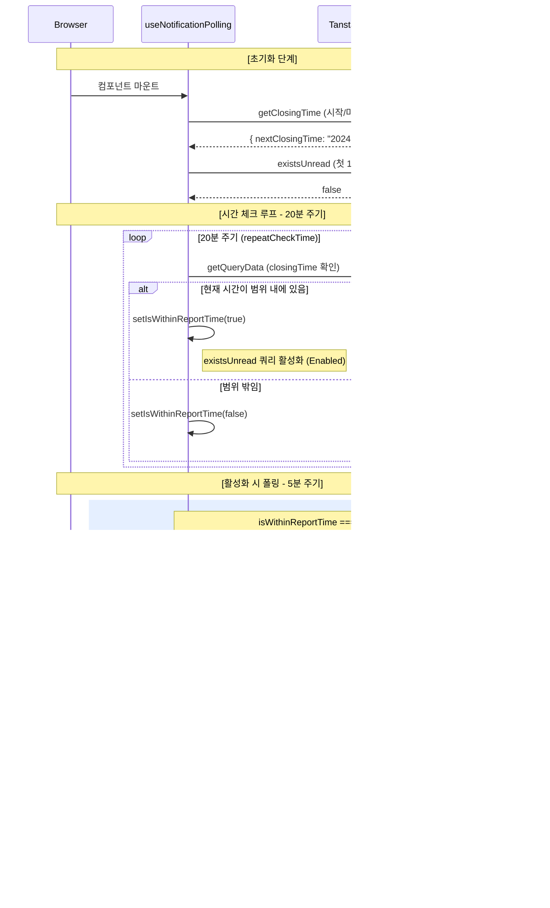

관련 코드 `useNotificationPolling.ts`

관련 PR https://github.com/softeerbootcamp-7th/WEB-Team3-CheckMate/pull/337

- [배경](#배경)
  * [알림 기능 요구사항](#알림-기능-요구사항)
  * [기술적 고려사항](#기술적-고려사항)
- [통신 방식 후보군 검토](#통신-방식-후보군-검토)
- [Polling을 선택한 이유](#polling을-선택한-이유)
- [전략적 Polling 설계](#전략적-polling-설계)
- [Polling 훅 구현](#polling-훅-구현)
  * [TanStack Query 활용](#tanstack-query-활용)
  * [타이머 관리](#타이머-관리)
  * [다이어그램](#다이어그램)
  * [추후 개선사항](#추후-개선사항)
- [참고자료](#참고자료)


## 배경

### **알림 기능 요구사항**

- **비정기적 알림:** 매장별로 설정된 '마감 시간' 이후 1시간 이내에 하루 단 한 번 '하루 리포트'가 발행됩니다.
- **실시간성:** 알림이 생성되었을 때 사용자가 화면을 보고 있다면 즉시 인지할 수 있어야 하나, 초 단위의 급박한 실시간성이 요구되지는 않습니다.
- **환경적 제약:** 사용자는 매장 마감 시점에 서비스를 켜놓을 확률이 높지만, 기기를 계속 주시하지는 않을 가능성이 큽니다.

### 기술적 고려사항

- **리소스 최적화:** 하루 한 번의 이벤트를 위해 24시간 내내 서버 자원을 점유하거나 불필요한 네트워크 트래픽을 유발하는 것은 비효율적입니다.
- **서버/클라이언트 부하 분산:** 백엔드 개발자의 구현 공수와 서버 유지 비용, 프론트엔드의 메인 스레드 점유율 사이의 균형이 필요했습니다.

## 통신 방식 후보군 검토

| **방식** | **특징** | **프로젝트 적용 시 장점** | **프로젝트 적용 시 단점** |
| --- | --- | --- | --- |
| **Short Polling** | 일정 주기마다 HTTP GET 요청 | 구현이 매우 간단하며 HTTP 인프라 활용 가능 | 리포트 미발행 시간대의 무의미한 요청 발생 |
| **Long Polling** | 응답을 대기시키다 데이터 발생 시 반환 | 실시간성이 보다 높고 불필요한 요청 횟수 감소 | 서버에서 연결 객체를 유지해야 하므로 리소스 소비 |
| **SSE (Server-Sent Events)** | 서버에서 클라이언트로 단방향 스트림 전송 | 표준 기술이며 자동 재연결 지원 | 하루 1회 알림을 위해 하루 종일 연결을 유지하는 오버헤드가 매우 큼 |
| **WebSocket** | 완전한 양방향 전폭 통신 | 낮은 지연 시간 및 효율적 전송 | 구현 복잡도가 높고 지속적 연결 유지 비용 발생 |
| **Web Push (FCM)** | 브라우저 종료 시에도 수신 가능한 푸시 | 앱과 유사한 사용자 경험 제공 | 도입 공수가 크고 기술적 숙련도가 필요함 |

## Polling을 선택한 이유

알림이 하루 1번만 발송되는 서비스 특성상, SSE나 WebSocket의 지속적 연결 유지 비용이 과도하다고 판단했습니다. 또한 백엔드 공수를 고려했을 때 FCM 도입도 어려운 상황이었습니다. 따라서 서버 입장에서 소켓 연결 유지보다 부담이 적은 GET 요청으로 처리하기로 결정했습니다.

단, 일반적인 Short Polling의 단점인 무의미한 요청을 최소화하기 위해 보완된 전략적 폴링 방식을 설계했습니다.

- 리포트는 매장별 마감 시간 전후로만 발행됩니다. 24시간 내내 폴링할 필요가 없습니다.
- 리포트 특성상 5분 정도의 지연은 사용자 경험에 치명적이지 않습니다.

위의 조건을 바탕으로, 20분 주기로 발행 시간대를 체크해서, 해당 시간대에만 5분 주기로 폴링하여 서버 부하를 최소화 하고자 했습니다.

## 전략적 Polling 설계

1. **첫 진입:** 매장의 마감 시간(`nextClosingTime`) 및 알림 여부(`existsUnread`)를 1회 조회합니다.
2. **준비 단계 (Idle Phase):**
    - **주기:** 20분
    - **목적:** 현재 시간이 마감 시간에 근접했는지 체크.
    - **로직:** `nextClosingTime`(캐싱됨)을 현재 시간과 비교하여, 활성 단계로 넘어갑니다.
3. **활성 단계 (Active Phase):**
    - **조건:** 현재 시간이 `마감 시간` ~ `마감 1시간 후` 사이일 때.
    - **주기:** 5분 (실시간성 확보)
    - **목적:** 리포트 발행 알림 조회
    - **로직:**
        - 미열람 알림(`existsUnread`)이 확인되어 성공적으로 데이터를 수신한 경우
        - 마감 시간으로부터 1시간이 경과하여 유효 범위를 벗어난 경우
        - 위 조건 충족 시 다시 `nextClosingTime`을 다시 패치하고 '준비 단계'로 넘어갑니다.


## Polling 훅 구현

### **TanStack Query 활용**

1. `useQuery`의 `enabled` 옵션을 통한 조건부 폴링 제어
    - `isWithinReportTime`이라는 상태 변수를 `enabled`에 주입했습니다.
    - 마감 시간이 아닐 때는 쿼리 자체가 '정지(Disabled)' 상태가 되어 불필요한 네트워크 요청과 백그라운드 연산을 원천 차단합니다.
2. 동적인 `refetchInterval`
    - `refetchInterval: isWithinReportTime ? 5000 : false`
    - 조건이 충족될 때만 5분 주기로 폴링을 수행합니다. React Query는 이전 요청이 완료된 후부터 시간을 계산하므로, 네트워크 지연으로 인해 요청이 겹치는 Request Race Condition을 자동으로 방지합니다.
3. `fetchQuery`와 `invalidateQueries`를 통한 명령형 쿼리
    - `fetchQuery`: 컴포넌트 마운트 시점에 타이머를 기다리지 않고 즉시 마감 시간을 조회하여 첫 번째 `isWithinReportTime`을 결정합니다.
    - `invalidateQueries`: 알림 수신 성공 시, 캐시된 마감 시간을 무효화하여 즉시 서버로부터 다음 날 마감 시간을 가져오도록 강제합니다.

```jsx
// 주요 로직 요약
const { data: existsUnread } = useQuery({
  ...notificationOptions.existsUnread,
  // 특정 시간 범위 내에서만 5분 주기로 서버에 요청을 보냄
  enabled: isWithinReportTime,
  refetchInterval: isWithinReportTime ? NOTIFICATION_POLLING_INTERVAL : false,
});
```

### **타이머 관리**

클라이언트 사이드에서 장시간 돌아가는 폴링 시스템은 제대로 관리하지 않으면 브라우저 성능을 저하시킵니다. 이를 방지하기 위해 `setTimeout`을 사용할 때 타이머 누수 관리에 신경 썼습니다.

- `useRef`를 통한 참조 관리: `timeoutId`를 `useRef`에 저장하여 컴포넌트의 전 생애주기 동안 접근 가능하게 했습니다.
- `useEffect` 클린업: 컴포넌트가 언마운트될 때 `clearTimeout(timeoutId.current)`를 호출하여 예약된 모든 타이머 스케줄을 즉시 파기합니다.
- `mountedRef`로 컴포넌트 마운트 관리: 비동기 요청 도중 컴포넌트가 언마운트되면, 요청이 끝난 후 상태 업데이트나 `setTimeout`을 호출하여 생기는 누수를 막기 위해 `mountedRef`가 `true`인 경우에만 허용했습니다.
- 에러 처리: 데이터 통신 시 오류가 발생하더라도 폴링 타이머가 멈추지 않도록 `catch` 구조를 설계했습니다.

### 다이어그램


### 추후 개선사항

현재는 `existsUnread`로 아직 읽지 않은 알림이 있는지 여부만 받아오고 있습니다.

그러나 오늘의 발행 시간대에 리포트가 발행되었는지 여부는 `existsUnread`만으로는 알 수 없다는 문제가 있습니다. 사용자가 알림을 읽지 않아서 미열람 상태로 계속 있는 경우 `true` 값이 변하지 않기 때문입니다. API에 마지막 미열람 알림의 시간 또는 날짜를 함께 받아와서 이를 개선할 수 있으나, 시간적 문제로 반영하지 못했습니다.

## 참고자료

https://lucas.codesquad.kr/Softeer-7th/course/u/%ED%8C%80-%ED%94%84%EB%A1%9C%EC%A0%9D%ED%8A%B8/%ED%95%99%EC%8A%B5-%EC%B0%B8%EA%B3%A0---%ED%94%84%EB%A1%A0%ED%8A%B8%EC%97%94%EB%93%9C/%EB%8D%B0%EC%9D%B4%ED%84%B0%ED%86%B5%EC%8B%A0-%EC%8B%A4%EC%8B%9C%EA%B0%84-%EC%96%91%EB%B0%A9%ED%96%A5 (소프티어 부트캠프 강의자료)
https://www.devunpacker.com/blog/tanstack-query-refetchinterval-polling-control